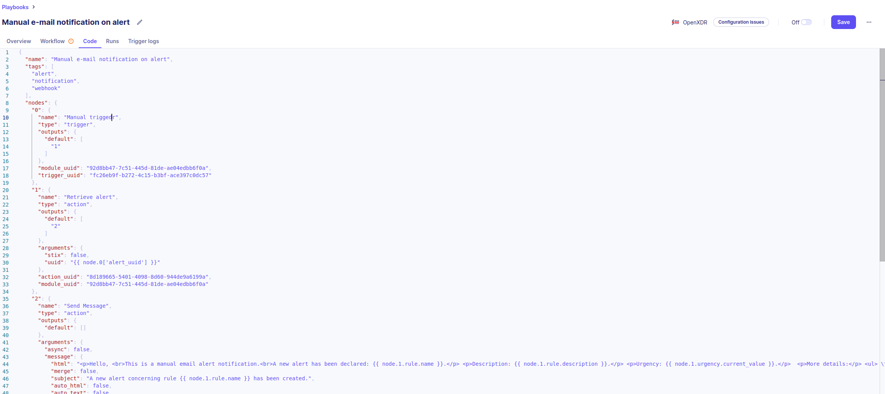

# Playbooks format JSON Schema

Sekoia.io playbooks are JSON documents, conforming to the following JSON schema.

You can freely use this open specification to share and publish playbook templates that will be instantly usable in a Sekoia.io community.

``` title="sekoiaio_playbooks.schema.json"
--8<-- "sekoiaio_playbooks.schema.json"
```

### Upload a JSON playbook to your Sekoia.io community

Active Sekoia.io Defend subscribers can upload a playbook from any source via [a POST API endpoint](https://docs.sekoia.io/xdr/develop/rest_api/playbooks/#tag/Playbooks/operation/post_playbooks_resource) or via copy-paste in the Code tab:



```bash
curl -X POST https://api.sekoia.io/v1/symphony/playbooks \
-H "Authorization: Bearer <YOUR_API_KEY>" \
-H 'Content-Type: application/json; charset=utf-8' \
--data-binary @- << EOF
{
  "name": "Manual e-mail notification on alert",
  "tags": [
    "alert",
    "notification",
    "webhook"
  ],
  "nodes": {
    "0": {
      "name": "Manual trigger",
      "type": "trigger",
      "outputs": {
        "default": [
          "1"
        ]
      },
      "module_uuid": "92d8bb47-7c51-445d-81de-ae04edbb6f0a",
      "trigger_uuid": "fc26eb9f-b272-4c15-b3bf-ace397c0dc57"
    },
    "1": {
      "name": "Retrieve alert",
      "type": "action",
      "outputs": {
        "default": [
          "2"
        ]
      },
      "arguments": {
        "stix": false,
        "uuid": "{{ node.0['alert_uuid'] }}"
      },
      "action_uuid": "8d189665-5401-4098-8d60-944de9a6199a",
      "module_uuid": "92d8bb47-7c51-445d-81de-ae04edbb6f0a"
    },
    "2": {
      "name": "Send Message",
      "type": "action",
      "outputs": {
        "default": []
      },
      "arguments": {
        "async": false,
        "message": {
          "html": "<p>Hello, <br>This is a manual email alert notification.<br>A new alert has been declared: {{ node.1.rule.name }}.</p> <p>Description: {{ node.1.rule.description }}.</p> <p>Urgency: {{ node.1.urgency.current_value }}.</p>  <p>More details:</p> <ul> \t <li>Entity name: {{ node.1.entity.name }}</li>\t <li>Alert type category: {{ node.1.alert_type.value }}</li> <li>Kill Chain: {{ node.1.kill_chain_short_id }}</li>\t <li>Created at: {{ node.1.created_at|timestamp_to_iso8601 }}</li> <li>Source: {{ node.1.source | replace(\".\", \"[.]\", 1) }}</li> \t <li>Target: {{ node.1.target | replace(\".\", \"[.]\", 1) }}</li> <li>Check https://app.sekoia.io/sic/alerts/{{ node.1.short_id }} for more information.</li> </ul><br>  <ul><p>Commentaries:</p>      <li>{{ comment.content }}</li>  </ul><br>  <ul><p>Countermeasures:</p>      <li>{{ countermeasure.description }}</li>  </ul><br>",
          "merge": false,
          "subject": "A new alert concerning rule {{ node.1.rule.name }} has been created.",
          "auto_html": false,
          "auto_text": false,
          "from_name": "Example.fr",
          "important": false,
          "from_email": "no-reply@example.fr",
          "track_opens": false,
          "track_clicks": false,
          "url_strip_qs": false,
          "view_content_link": false,
          "preserve_recipients": false
        }
      },
      "action_uuid": "cb61842a-e09f-417d-acdf-34c818c61c87",
      "module_uuid": "bc2699a6-93e5-4d74-816d-4186d6eb3ce8"
    }
  },
  "description": "Send an email about an alert when receiving a webhook event",
  "community_uuid": "3c780003-f368-464b-9712-f9d681fbba2a"
}
EOF
```