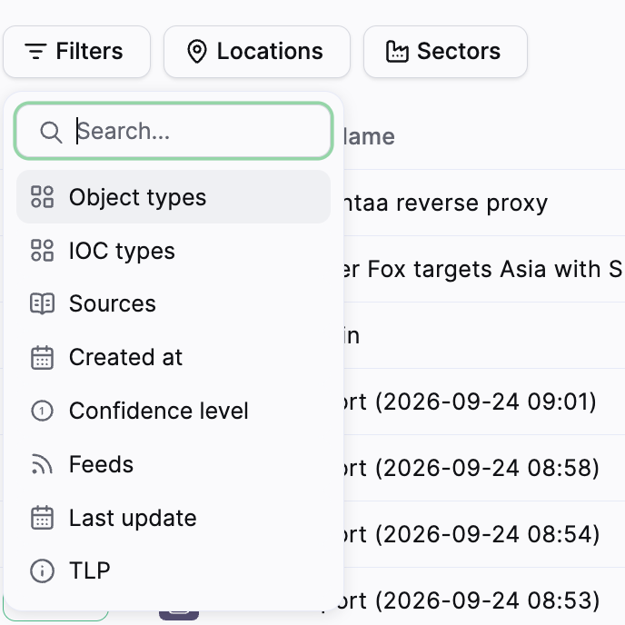
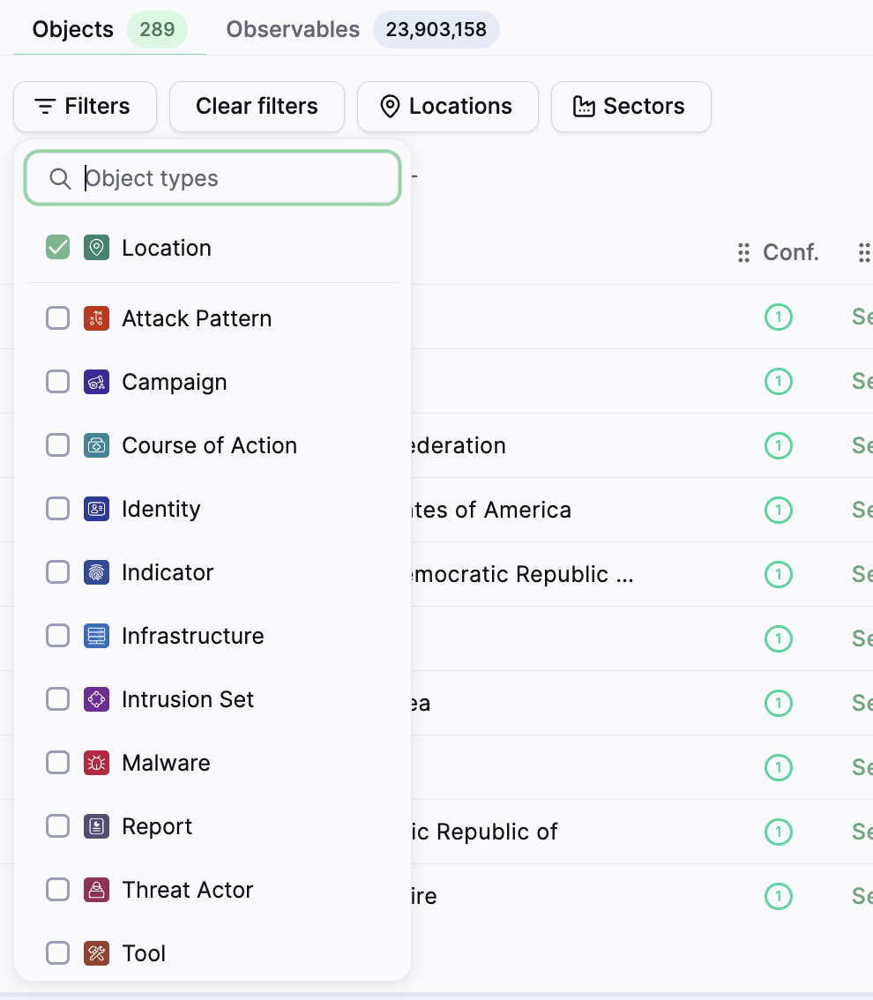

# Intelligence

Use the Intelligence page to search Sekoia’s database for objects and observables. Filter the results, review matching records, and open a result to continue your investigation.

## Open Intelligence

1. From the application menu, select **Intelligence**.

2. Enter a value in the search bar.

    You can search for an object name, report title, domain, IP address, hash, observable value, or other indexed content.

{: style="max-width:100%"}

## Run a search

1. Enter one or more values in the search bar.

2. Press **Enter** to run the search.

3. To search for multiple values at once, press **Shift+Enter** to add a new line, then paste the values.

The search can match names, descriptions, aliases, report content, external references, and Location country codes.

To search for a Location, enter its name. Results can include countries, regions, or larger geographic areas. For example, `europe` can return **Europe**, **Southern Europe**, and other matching Locations.

For a country, you can also use its two-letter country code, following the [ISO 3166-1](https://www.iso.org/obp/ui/#iso:pub:PUB500001:en) reference. For example, use `FR` for France or `CN` for China.

!!! tip
    To open several results in new tabs, right-click an object or use **Option+click** on macOS or **Shift+click** on Windows.

## Select a result type

Depending on your query, the results can include:

- **Objects**;
- **Observables**;
- **Unknown Observables**.

Each tab displays the number of matching results. Select a tab to review its results.

Use the **Known** and **Unknown** views to distinguish observables that are already in the database from values that Sekoia does not recognize.

## Filter results

The same filter workflow applies to the results available in the selected tab.

1. Select **Filters**.

2. Select a filter category.

    Available categories can include:

    - **Object types**;
    - **IOC types**;
    - **Sources**;
    - **Created at**;
    - **Confidence level**;
    - **Feeds**;
    - **Last update**;
    - **TLP**.

3. Select one or more values.

    Sekoia adds the active filter above the table as a filter chip.

4. Refine or remove the filter.

    Reopen the filter menu to change the selected values. Select **Clear filters** to remove all active filters, or remove one filter from its chip.

The **Object types** filter lets you restrict results to a specific type, such as **Location**, **Sector**, **Source**, **Campaign**, or **Malware**.

### Use shortcut filters

On the **Objects** tab, select **Locations** or **Sectors** to apply the corresponding object-type filter directly. The buttons appear next to **Filters** and use the same filtering behavior as **Filters > Object types**.

After you select a shortcut, the active filter appears above the table as a chip, for example:

- `Object types is Location`;
- `Object types is Sector`.

When you reopen the filter menu, the selected object type is already checked. Select **Clear filters** to remove the shortcut filter.

{: style="max-width:100%"}
{: style="max-width:100%"}

## Review search results

Search results appear in a table. The visible columns depend on the result type and workspace configuration. They can include:

- **TLP**;
- **Type**;
- **Name**;
- **Subtypes**;
- **Conf.**;
- **Sources**;
- **Last Edited**;
- **Created**;
- global or workspace telemetry.

For Location objects:

- a country Location displays its country flag in the **Type** column;
- a region or other Location without a country displays the Location icon.

Use the sort selector to change the order. **Pertinence** is the default sort option in the delivered interface.

Use the column selector to show or hide columns. Use **Items per page** and the pagination controls to browse the results.

## Copy observables

1. Open the **Observables** tab.

2. Select the checkbox next to each observable you want to copy.

3. Select **Copy**.

Sekoia can identify some pasted values and leave others as unknown. Review both result views when you need to check the complete list.

## Open a result

Select an object or observable name to open its details page. Continue with [Investigate an object](/cti/features/consume/investigate_an_object.md) to review an object’s context, relationships, graph, and reports.

## Result

You can search objects and observables from one page, apply filters without repeating the workflow for each result type, and open a result for further investigation.

## Related articles

[Observables](/cti/features/consume/observables.md): Overview of observable types, tags, validity, sources, and relationships.

[Investigate an object](/cti/features/consume/investigate_an_object.md): How to review an object’s context, relationships, graph, and reports.

[Data model](/cti/features/data_model.md): Reference for objects, observables, relationships, sources, and confidence.
