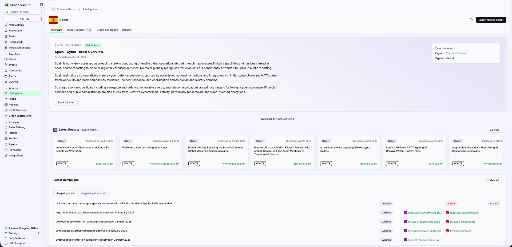
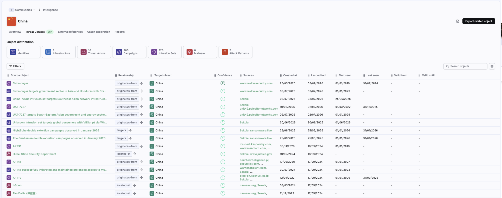
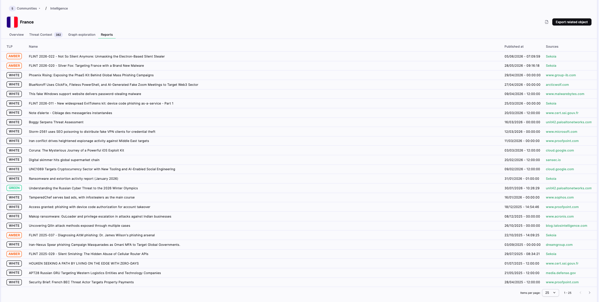

# Investigate an object

Use an object page to review an object’s profile, relationships, external references, graph, and associated reports. The available tabs and actions depend on the object type, community, and your permissions.

## Open an object page

1. Search for an object in [Intelligence](/cti/features/consume/intelligence.md).

2. Select the object name in the results.

    The object page opens with the object name, its icon or flag, and the tabs available for that object type.

The page can include:

- **Overview**;
- **Threat Context**;
- **External references**;
- **Graph exploration**;
- **Reports**.

Not every object type has every tab.

{: style="max-width:100%"}

## Review the Overview tab

The **Overview** tab provides a summary when it is available for the object type.

For a Location, the Overview tab can include:

- an **Intelligence Brief** with an author label and update date;
- a summary of the Location;
- metadata such as object type, region, and capital;
- a **Read full brief** action;
- a **Latest Reports** section with a timeframe, report cards, TLP labels, publication dates, and sources;
- a **View all** action for the complete report list.

Select a report card or source when a link is available.

## Review Threat Context

The **Threat Context** tab lists objects and relationships associated with the current object.

### Review object distribution

Object distribution cards show the number of related objects by type. Depending on the object, the cards can include Identities, Infrastructure, Threat Actors, Campaigns, Intrusion Sets, Attack Patterns, and Malware.

Select a distribution card to focus on a type of related object when the action is available.

### Review relationships

The relationship table can include:

- **Source object**;
- **Relationship**;
- **Target object**;
- **Confidence**;
- **Sources**;
- **Created at**;
- **Last edited**;
- additional relationship dates when available.

Use **Filters** to narrow the relationships. Use **Search objects** to find a related object by name. Select an object name to open its object page.

Relationship values can include `targets`, `originates-from`, and `located-at`.

{: style="max-width:100%"}

## Review external references

Select **External references** to review references associated with the object. Select a reference to open the linked content when a destination is available.

## Explore the object graph

1. Select **Graph exploration**.

2. Review the object in the graph canvas.

3. Use the side panel to switch between **Details** and **Relationships**.

4. Use the graph search, layer, layout, zoom, fit-to-view, and fullscreen controls as needed.

For the general graph workflow, see [Graph Explorations](/cti/features/consume/graph_explorations.md).

## Review associated reports

1. Select **Reports**.

2. Review the report list.

    The table can include:

    - **TLP**;
    - **Name**;
    - **Published at**;
    - **Sources**.

3. Use **Items per page** and the pagination controls to browse additional reports.

Select a report title or source when a link is available. For more information, see [FLINT Reports](/cti/features/consume/flints.md) and [External Reports](/cti/features/consume/external_reports.md).

{: style="max-width:100%"}

## Export related objects

Select **Export related object** to open the export dialog. Choose the scope and format available in your workspace, then confirm the export.

For export options and formats, see [Data Export](/cti/features/consume/export.md).

## Result

You can move from a search result to the object’s profile, relationships, references, graph, and associated reports without repeating the original search.

## Related articles

[Intelligence](/cti/features/consume/intelligence.md): How to search and filter objects and observables.

[Observables](/cti/features/consume/observables.md): Overview of observable types, tags, validity, sources, and relationships.

[Data model](/cti/features/data_model.md): Reference for object types, relationships, sources, and confidence.

[Graph Explorations](/cti/features/consume/graph_explorations.md): How to explore relationships in a visual graph.

[Data Export](/cti/features/consume/export.md): How to export related objects.

[FLINT Reports](/cti/features/consume/flints.md): Overview of Sekoia threat intelligence reports.

[External Reports](/cti/features/consume/external_reports.md): Overview of reports from external sources.
