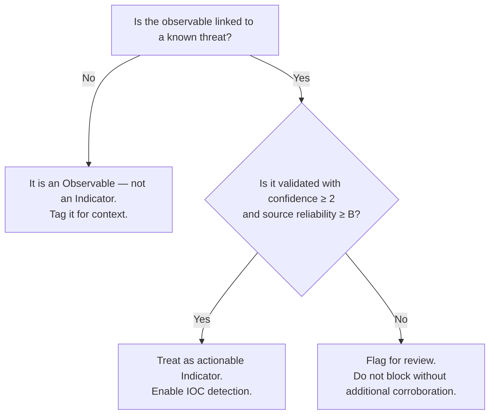

Voici l'article amélioré avec l'ensemble des suggestions appliquées, en markdown MkDocs :

---

## Changements appliqués

Voici un résumé des modifications effectuées :

1. **Origine de l'échelle Admiralty** : paragraphe introductif ajouté avant les tableaux Confidence et Reliability.
2. **Nouvelle sous-section** : "Reading Confidence and Reliability together" avec notation combinée `<Letter><Number>` et exemples.
3. **Colonne "Example" dans le tableau Confidence** : exemples CTI concrets pour chaque niveau.
4. **Colonne "Example" dans le tableau Reliability** : exemples de sources pour chaque niveau.
5. **Bloc JSON enrichi** : l'exemple existant est remplacé par un indicateur complet avec logique de scoring expliquée.
6. **Encart "Known limitations"** : note sur les limites connues de l'échelle Admiralty.
7. **Diagramme Mermaid** : arbre de décision Observable vs Indicator.

---

Voici le résultat complet :

````markdown
# Data Model

The Intelligence Center uses the industry standard STIX ([version 2.1](https://oasis-open.github.io/cti-documentation/stix/intro.html)) to represent information.

## Objects

STIX uses JSON objects with pre-defined schemas to represent Cyber Threat Intelligence data. The knowledge graph is based on nodes (STIX Domain Objects or SDO) and relationships (STIX Relationship Objects or SRO).

The Intelligence Center supports the following STIX Domain Objects:

{: style="max-width:100%"}

## Observables

An observable is a technical information that can detect a potential threat. They are derived from all data contained in the Intelligence Center but are not always contextualized.

!!! note

    If an observable clearly represent a malicious activity then it is an IoC (Indicator of Compromise).

Observables are automatically extracted from various sources : public, subscriptions, partners, SEKOIA internal analysis.

The Intelligence Center supports the following observables:

{: style="max-width:100%"}

### What is the difference between an indicator and an observable?

To understand the difference between an indicator (an object type) and an observable, we have to dig deeper into the definition of each one of these.

**Observables**

- These are different kinds of technical artifacts
- They are not necessary malicious (example: `google.com`)
- They can be enriched with tags to contextualize the (non)-threat
    - These tags allow you to enrich logs/events in [Sekoia.io](http://Sekoia.io) XDR
- They are not provided in the CTI feed (API / TAXII / MISP, etc.)
- They don't directly raise alerts in [Sekoia.io](http://Sekoia.io) XDR but tag-based detection rules can be created to allow that
- They can be manually enriched through the web application and can have dedicated relations (for example: `resolves-to`, `belongs-to`, etc.)
- They are usable (thanks to the tags system) within [Sekoia.io](http://Sekoia.io) XDR to create warning rules that provide context to the analysts who are in charge of producing Intelligence or to avoid false positives creation.

**Indicators**

- These are Indicators of Compromise (IoC)
- They are always related to a threat (malware, campaign, intrusion set, threat actor, vulnerability, etc.) and they are always contextualized with a confidence rating, a validity date and a Kill chain phase
- They are based on observables
- They are exported in the CTI feed (API / TAXII / MISP, etc.) to allow a contextualized detection
- They raise real-time alerts in [Sekoia.io](http://Sekoia.io) XDR but also in the past through retro hunting which depends on the validity period of the indicator and the log retention duration

### Decision guide: Observable or Indicator?

The following diagram can help analysts determine how to handle a piece of intelligence:



## External Sources

One of the founding principle of the Intelligence Center is the consolidation of information coming from several sources.

Sources are represented in STIX by `Identity` objects.

Our consolidation strategy means that the `created_by_ref` field of the STIX objects will always be set to the SEKOIA identity. The sources that contributed to one of our STIX object are available, as references, in the `x_inthreat_sources_refs` custom field.

As an example, here is a complete `Indicator` object illustrating how `confidence` and source references work together:

```json
{
  "type": "indicator",
  "name": "Malicious C2 domain — APT28 campaign",
  "id": "indicator--a1b2c3d4-...",
  "pattern": "[domain-name:value = 'update-service-cdn.com']",
  "confidence": 2,

  "created_by_ref": "identity--357447d7-9229-4ce1-b7fa-f1b83587048e",  # SEKOIA

  "x_inthreat_sources_refs": [
    "identity--357447d7-9229-4ce1-b7fa-f1b83587048e",  # SEKOIA
    "identity--c78cb6e5-0c4b-4611-8297-d1b8b55e40b5"   # The MITRE Corporation
  ]
}
```

In this example, `confidence: 2` means the information is **probably true** (not yet independently confirmed). To evaluate the source's reliability, look up each identity in `x_inthreat_sources_refs`. If Sekoia's own identity (`357447d7-...`) carries a reliability of **A** on its `Identity` object, the combined reading approximates **A2**: a trusted source reporting something likely true but awaiting confirmation.

## Confidence

STIX 2.1 adds an optional `confidence` field for an object creator to express how confident we are about the information.

Both the Confidence and Reliability scoring systems are derived from the **Admiralty System** (also known as the NATO Intelligence Grading System), formally codified in **STANAG 2511 / AJP-2.1**. Originally developed for military intelligence, this 6×6 alphanumeric scale pairs a letter (source reliability) with a number (information credibility) to give analysts an immediate, standardised assessment of any piece of intelligence. In Sekoia's Intelligence Center, these two dimensions are applied independently: `confidence` scores the object's content, while the `confidence` field on a source `Identity` scores that source's track record.

When specified, this confidence level on objects should be read with the [Admiralty Credibility](https://docs.google.com/document/d/1Cqi89CU6FwEdLjGFqMnxpl3T4iSWE_gbImBq2WXEXYk/edit#heading=h.1v6elyto0uqg) scale.

| Number | Meaning | Details | Example |
| --- | --- | --- | --- |
| 1 | Confirmed by other sources | Confirmed by other independent sources; logical in itself; consistent with other information on the subject | A C2 domain flagged independently by three separate threat intelligence providers (e.g. VirusTotal, a CERT, and Sekoia's own analysis), all linking it to the same Cobalt Strike campaign. |
| 2 | Probably true | Not confirmed; logical in itself; consistent with other information on the subject | A newly registered domain matching the naming pattern of a known APT's infrastructure, identified by Sekoia analysts but not yet confirmed by a third party. |
| 3 | Possibly true | Not confirmed; reasonably logical in itself; agrees with some other information on the subject | An IP address reported by a single community feed as a possible Tor exit node used in credential stuffing — plausible but unverified. |
| 4 | Doubtful | Not confirmed; possible but not logical; no other information on the subject | A hash shared on a low-quality paste site with no context, no related campaign, and no corroboration — technically possible but logically weak. |
| 5 | Improbable | Not confirmed; not logical in itself; contradicted by other information on the subject | An indicator attributed to APT28 that contradicts the group's known TTPs (e.g. a macOS payload for a group exclusively documented targeting Windows environments). |
| 6 | Truth cannot be judged | No basis exists for evaluating the validity of the information | A brand-new observable type with no historical baseline in the Intelligence Center — there is simply no reference frame to evaluate it. |

## Reliability

Next to the source (object type: `Identity`), the `confidence` score may be specified to express the source's reliability. When specified, this reliability level should be read with the [Admiralty Reliability](https://docs.google.com/document/d/1Cqi89CU6FwEdLjGFqMnxpl3T4iSWE_gbImBq2WXEXYk/edit#heading=h.1v6elyto0uqg) scale.

| Letter | Meaning | Details | Example |
| --- | --- | --- | --- |
| A | Completely reliable | No doubt of authenticity, trustworthiness, or competency; has a history of complete reliability | A national CERT with years of validated reporting, or Sekoia's own analyst team (`identity--357447d7-...`). |
| B | Usually reliable | Minor doubt about authenticity, trustworthiness, or competency; has a history of valid information most of the time | A well-known commercial threat intelligence vendor whose feeds are generally accurate but occasionally include stale or recycled indicators. |
| C | Fairly reliable | Doubt of authenticity, trustworthiness, or competency but has provided valid information in the past | An open-source feed (e.g. a community blocklist) that has provided valid IOCs in the past but is inconsistent in quality. |
| D | Not usually reliable | Significant doubt about authenticity, trustworthiness, or competency but has provided valid information in the past | A low-moderation threat-sharing community where submissions are rarely vetted. |
| E | Unreliable | Lacking in authenticity, trustworthiness, and competency; history of invalid information | A source with a documented history of publishing false positives, recycled data, or fabricated indicators. |
| F | Reliability cannot be judged | No basis exists for evaluating the reliability of the source | A new partner or source that has never been used before — no track record exists to evaluate. |

### Reading Confidence and Reliability together

The two scores must be interpreted jointly. A high-reliability source can still carry low-confidence information (e.g. a trusted partner reporting an unverified lead), and a low-reliability source can occasionally provide confirmed information. The combination is noted as `<Letter><Number>` in traditional intelligence doctrine. For example:

| Combined rating | Interpretation |
| --- | --- |
| **A1** | Completely reliable source, confirmed by other sources. The highest possible trust level. |
| **B2** | Usually reliable source, probably true. Solid working assumption for most operational decisions. |
| **C3** | Fairly reliable source, possibly true. Use with caution; seek corroboration. |
| **F6** | Source reliability unknown, truth cannot be judged. Raw, unvalidated data. |

In Sekoia's STIX objects, you can approximate this combined rating by cross-referencing the object's `confidence` field with the `confidence` field on the corresponding source `Identity` in `x_inthreat_sources_refs`.

!!! note "Known limitations of the Admiralty scale"

    The Admiralty System was originally designed for human intelligence (HUMINT) in military contexts. Research has shown that analysts tend to conflate source reliability with information credibility when applying the scale, making the two dimensions harder to separate in practice (NATO STANAG 2511; Irwin & Mandel, 2019). In a CTI context, Sekoia applies these scores programmatically based on source history and cross-source corroboration, which reduces (but does not eliminate) this subjectivity. When in doubt, always check the number of contributing sources in `x_inthreat_sources_refs` as an additional data point.
````
