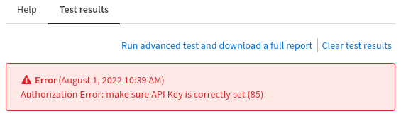

# Palo Alto Cortex XSOAR

## Prerequisite

On Sekoia.io XDR, create an API KEY with the following permission:
- `INTHREAT_READ_OBJECTS` (`8d9901dc-0508-4472-b3c1-5ad5efc96032`): Read objects from InThreat

[More information on API KEY creation](../../../getting_started/manage_api_keys.md)

## Install

In your Palo Alto Cortex XSAOR instance go to "Marketplace" and search for "sekoia".

Choose the "SEKOIAIntelligenceCenter" pack to open pack description and use the "Install" button to add the pack to your instance.

Navigate to "Settings" where "SEKOIAIntelligenceCenter" should have appeared and clic the "Add instance" button to add a new instance.

Input a Sekoia.io XDR API KEY and save your configuration.

Use the test button to validate your configuration (your result should be green).

Example of failed test.

Example of successful test.

You can now use the integration by typing for example `!GetObservable value="eicar@sekoia.io" type="email-addr"`.

To learn how to use the integration, please read the [following documentation](https://xsoar.pan.dev/docs/reference/integrations/sekoia-intelligence-center#commands) which describe every command input and output.
