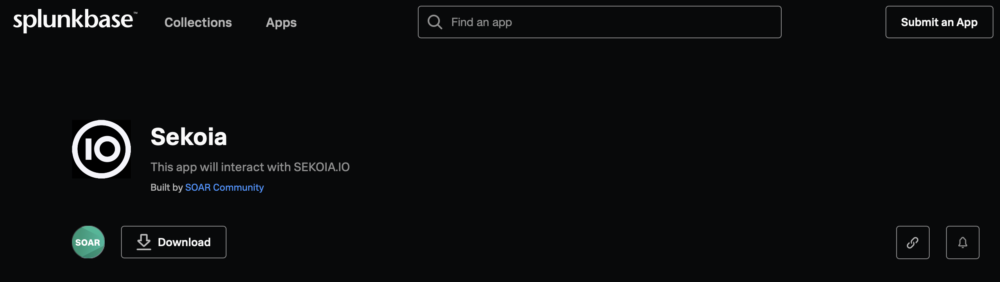
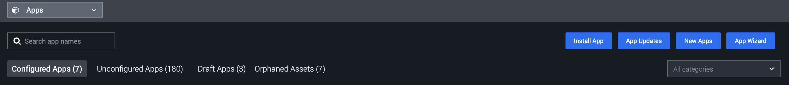
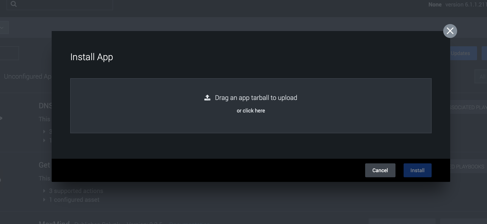

# External Integrations: Splunk SOAR

## Description

An App for Splunk SOAR is available to interact with our SEKOIA.IO API.

For the moment there are just three actions for the SEKOIA CTI API :

- **Get indicator** : Action that allow the user to get an indicator according to some criteria.
- **Get indicator Context**: Action that allow the user to get the context of an indicator.
- **Get Observable**: Create an action that allow the user to get an observable according to some criteria

## Prerequisite

On Sekoia.io CTI, create an API KEY with the following permission:
- `INTHREAT_READ_OBJECTS` (`8d9901dc-0508-4472-b3c1-5ad5efc96032`): Read objects from InThreat

[More information on API KEY creation](../../../getting_started/manage_api_keys.md)

## Install

In your Splunk SOAR instance, you can directly go to the `app` part and search for `sekoia` in the `unconfigured apps`. 

In the case, you can't find it, Follow this steps bellow : 

1/ Search for it in the [splunk marketplace](https://splunkbase.splunk.com/app/7142)

2/ Download the app as tar file

3/ Go to the `app` part in your instance

4/ click on `install app` button

5/ Put the tar file there.

6/ finally you can start using it.

To learn how to use the integration, please read the [technical documentation ](https://github.com/splunk-soar-connectors/sekoiaio/blob/next/README.md)