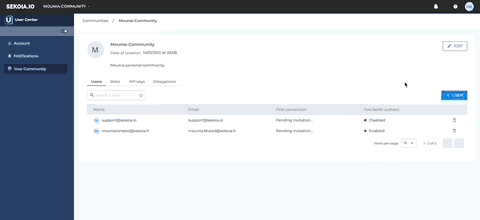

title: New Invitation Feature in the User Center
hide: navigation
  
**July 8, 2021**
# New Invitation Feature in the User Center

The change of the invitation process makes it easier to : 

- Assigning multiple roles to users: different roles can be assigned at the same time when sending the invitation.
- Adding a user known to SEKOIA.IO: you can add existing users in other communities directly to a new one without going through the email invitation and authentication process.

