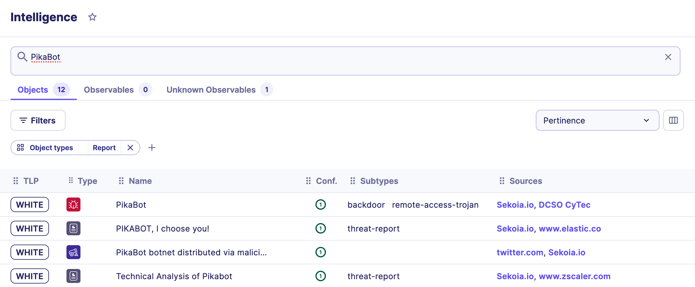

# Intelligence Database

## Introduction

Looking for a Threat actor? A specific Malware? A report on a topic of interest? Or a URL that looks suspicious? The Intelligence page possesses a search engine with complex filtering capabilities to navigate through millions of data. This threat knowledge base is updated on a daily basis by Sekoia.io analysts to make sure all kinds of threats are covered.

## How to search

### Search bars

The two ways to find what you need in the knowledge base is to:

1. Use the search bar embedded in the menu. It’s accessible from any page of the app and enables a quick search in the database.
2. Click `Intelligence` from the app menu and use the main search bar to browse the knowledge you need.

<figure><figcaption></figcaption></figure>

You can search for **multiple items at the same time**. To skip a line and paste multiple items, press `Shift-Enter` and paste your content.

!!! tip You can easily open multiple search results in new tabs by right-clicking on an object and using your mouse, `option+click` (for Mac), or `shift+click` (for Windows).

### Tabs

After you’ve typed your search and clicked on `enter`, two or three tabs appear under the search bar: one for **objects**, one for **observables** and one for **unknown observables**.

You can refer to [this page](../../../cti/features/data_model.md) to understand what objects and observables are and how our data model works.

Each tab has a counter that informs users about the **number of items** in the database for each category.

For instance, if you search for `Google`, you will find numerous objects (reports, Intrusion sets, Indicators…) but only two observables.


Always check all tabs to be sure to get all information needed on a topic. Observables may not be harmful but they can be helpful in an investigation.


## Search for observables

###
