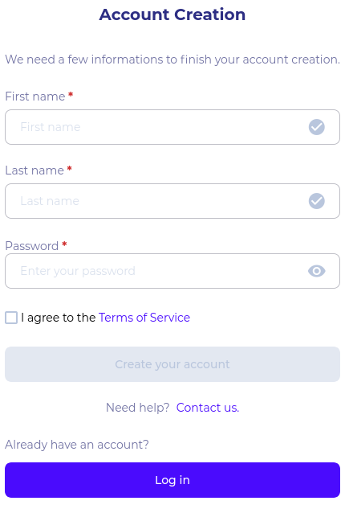

## Getting started

If you received an invitation to join a community and you do not already have an account on SEKOIA.IO, you will have to create one.

When opening the invitation by clicking on 'OPEN INVITATION' button, you will arrive on the account creation page.

Fill-out the form while keeping in mind that **you won’t be able to change your username afterwards**.

Check “I agree with the terms of service” and create your account.

You will then have to accept the invitation to join the community.

!!! note
    Your access will depend on the permissions you are granted in the community you joined.

You can access the platform from any browser and on any device.

## How to navigate the platform

Once you are logged in into SEKOIA.IO, you can navigate through the platform using two menus:

- A collapsed navigation sidebar on the left that gives you access to all the work areas available on the platform. These areas are divided into subcategories: analyze, detect, investigate, remediate and configure for Operations Center, Collection for Intelligence Center.
- A contextual menu accessible through your profile picture in the top right that gives you access to your Settings and Communities.

!!! note
    Depending on the permissions granted to you, navigation between the Intelligence Center and the Operations Center is done by clicking on the name at the top of the sidebar.

## Set up your account

### User preferences

In the “settings” page, accessible by clicking on your avatar picture, you can edit your profile information like your name, company’s name and avatar. You can define your picture profile by either uploading a PNG file, asks to use your Gravatar or use your initials for your profile picture.

You can also enable [2-Factor Authentication](2fa.md) for your account or control your privacy by activating or deactivating an opt-out cookie.

All of these preferences are available through the contextual menu by clicking on “Settings”.

### Communities

When you first create an account, your personal community is created along with it and you can manage it as you please.

A “Community” allows you to share events, alerts, rules and information with some people. You can manage the rights of each member. You can have access to more than one community and depending on the permissions you are granted, you can have different roles in each of them.

When it comes to a community you manage, you can:

- Edit its name and description.
- Add new members and assign specific roles to them to enable them to access certain features.
- Determine which permissions you want to give them.
- Manage your API keys and configure delegations.
