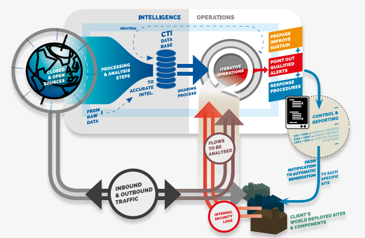

# Welcome to SEKOIA.IO

**SEKOIA.IO** is a **Cybersecurity Platform as a Service**, based on our ability to leverage threat intelligence to dynamically integrate it into an innovative approach of the cyberdefense.

SEKOIA.IO architecture couples the generation and operation of Threat Intelligence dynamic databases to a set of functions for analysis, guidance and treatment.
This technology brings together automation, sharing of indicators and implementation of playbooks to treat, on a large scale and in real time, the flows exchanged and data from other tools already deployed on the networks (internal security logs).

There are two main parts in SEKOIA.IO:

- The **Intelligence Center**, a Threat Intelligence knowledge base constantly updated by SEKOIA analysts
- The **Operation Center**,a SIEM application that can trigger alerts from the security events received,  based on two principles:

    - CTI rules based on dedicated CTI indicator feeds generated by SEKOIA.
    - Correlation rules between events.

In addition to a web interface, SEKOIA.IO provides **REST/API** for external apps for almost all of its features.

**In order to test SEKOIA.IO, you just have to create an account and send your logs to the platform.**
