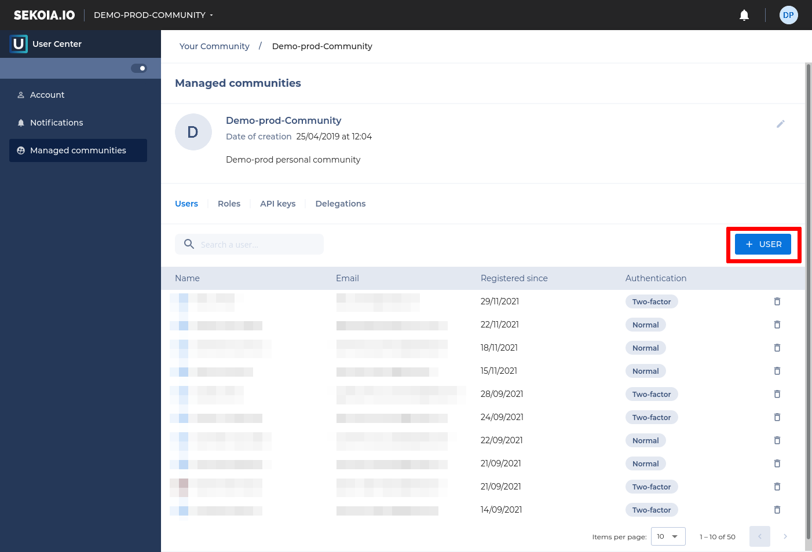

# Inviting users to join your community

You can invite anyone to become a member of your community using their email address.

!!! note
    You can invite as many users as you need in your community.

* In the top right corner of SEKOIA.IO, click your profile photo, then click on **Settings**.

{: style="" }

* On the left side of your account page, click on "Communities" and then on the community where you want to invite someone.

{: style=""}

* On the "Members" tag, click "Invite"

* In the invitation panel, type the email address of your invitee, assign a role to its future account and personalize the invitation with an optional note.

* Click "Send" invitation.

* The invited person will receive an email to join the community. They will need to accept the invitation before becoming a member of your community.
