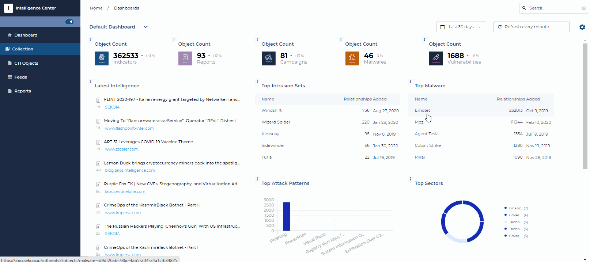

# Dashboards

## Default Dashboard

When connecting to the Intelligence Center, and if the permissions granted allow it, you arrive on the "Dashboard" page. This allows you to have a quick view of the content of the Intelligence Center as well as the most recently added information.

This functionality is available to all customers who subscribe to the Intelligence Center.

{: style="width: 100%; max-width: 100%"}

## Create and edit dashboards

The Default Dashboard cannot be modified. However, each user has the possibility of creating other dashboards, in order to obtain filtered views of data relevant to their use. You also have the possibility to duplicate an existing dashboard and to edit the resulting new one.

It is thus possible to create dashboards by sector of activity or by geographical area and the number of dashboards is not limited.

{: style="width: 100%; max-width: 100%"}

!!! note
    Each dashboard you create will be available to all members of your community.
