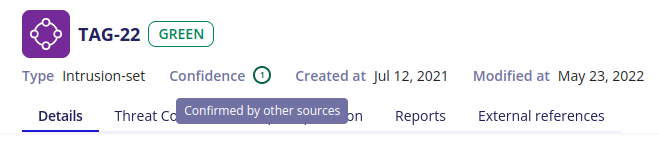

# Data Model

The Intelligence Center uses the industry standard STIX to represent information, in its upcoming [2.1 version](https://docs.google.com/document/d/1Cqi89CU6FwEdLjGFqMnxpl3T4iSWE_gbImBq2WXEXYk).

STIX uses JSON objects with pre-defined schemas to represent Cyber Threat Intelligence data. The knowledge graph is based on nodes (STIX Domain Objects or SDO) and relationships (STIX Relationship Objects or SRO).

The Intelligence Center supports the following STIX Domain Objects:

-   Attack Pattern
-   Campaign
-   Course of Action
-   Identity
-   Indicator
-   Intrusion Set
-   Location
-   Malware
-   Report
-   Threat Actor
-   Tool
-   Vulnerability

## External Sources

One of the founding principle of the Intelligence Center is the consolidation of information coming from several sources.

{: style="width: 100%; max-width: 100%"}

Sources are represented in STIX by `Identity` objects.

Our consolidation strategy means that the `created_by_ref` field of the STIX objects will always be set to the SEKOIA identity. The sources that contributed to one of our STIX object are available, as references, in the `x_inthreat_sources_refs` custom field.

As an exemple, here are parts of the `Spearphishing Link` object presented in the screenshot:

```
{
  "type": "attack-pattern",
  "name": "Spearphishing Link",
  "id": "attack-pattern--6cd1a813-ccdf-4ba0-9b54-cb808f1059cc",

  "created_by_ref": "identity--357447d7-9229-4ce1-b7fa-f1b83587048e",  # SEKOIA

  "x_inthreat_sources_refs": [
    "identity--357447d7-9229-4ce1-b7fa-f1b83587048e",  # SEKOIA
    "identity--c78cb6e5-0c4b-4611-8297-d1b8b55e40b5"   # The MITRE Corporation
  ],

  [...]
}
```

## Confidence

STIX 2.1 adds an optional `confidence` field for an object creator to express how confident (s)he is about the information.



The Intelligence Center uses the `confidence` field in two ways:

-   On objects, the `confidence` score may be specified to express a specific confidence level on an object. When specified, this confidence level should be read with the [Admiralty Credibility](https://docs.google.com/document/d/1Cqi89CU6FwEdLjGFqMnxpl3T4iSWE_gbImBq2WXEXYk/edit#heading=h.1v6elyto0uqg) scale.

|Score       |Label                     |Explanation                                                                                                |
|:----------:|:-------------------------|:----------------------------------------------------------------------------------------------------------|
|1           |Confirmed by other sources|Confirmed by other independent sources; logical in itself; Consistent with other information on the subject|
|2           |Probably True             |Not confirmed; logical in itself; consistent with other information on the subject                         |
|3           |Possibly True             |Not confirmed; reasonably logical in itself; agrees with some other information on the subject             |
|4           |Doubtful                  |Not confirmed; possible but not logical; no other information on the subject                               |
|5           |Improbable                |Not confirmed; not logical in itself; contradicted by other information on the subject                     |
|6           |Truth cannot be judged    |No basis exists for evaluating the validity of the information                                             |

-   On source objects (of type `Identity`), the `confidence` score may be specified to express the source's reliability. When specified, this confidence level should be read with the [Admiralty Reliability](https://docs.google.com/document/d/1Cqi89CU6FwEdLjGFqMnxpl3T4iSWE_gbImBq2WXEXYk/edit#heading=h.1v6elyto0uqg) scale.

|Score       |Label                       |Explanation                                                                                                         |
|:----------:|:---------------------------|:-------------------------------------------------------------------------------------------------------------------|
|A           |Completely reliable         |No doubt of authenticity, trustworthiness, or competency; has a history of complete reliability                     |
|B           |Usually reliable            |Minor doubt about authenticity, trustworthiness, or competency; has a history of valid information most of the time |
|C           |Fairly reliable             |Doubt of authenticity, trustworthiness, or competency but has provided valid information in the past                |
|D           |Not usually reliable        |Significant doubt about authenticity, trustworthiness, or competency but has provided valid information in the past |
|E           |Unreliable                  |Lacking in authenticity, trustworthiness, and competency; history of invalid information                            |
|F           |Reliability cannot be judged|No basis exists for evaluating the reliability of the source                                                        |
