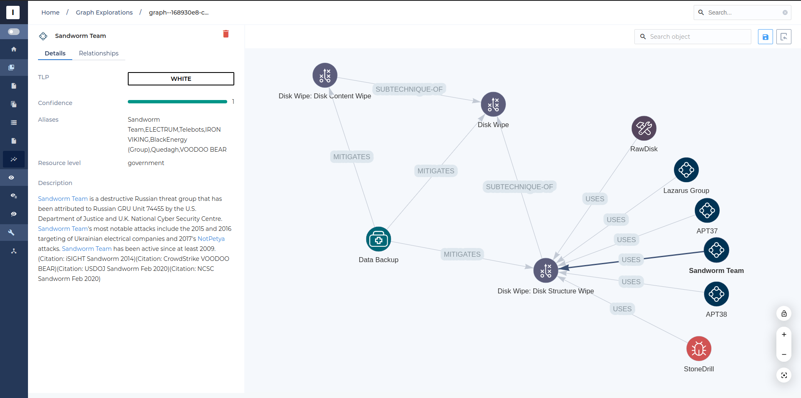
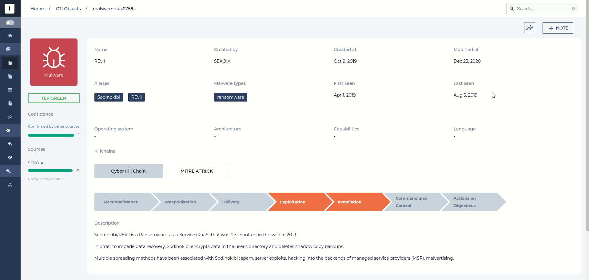
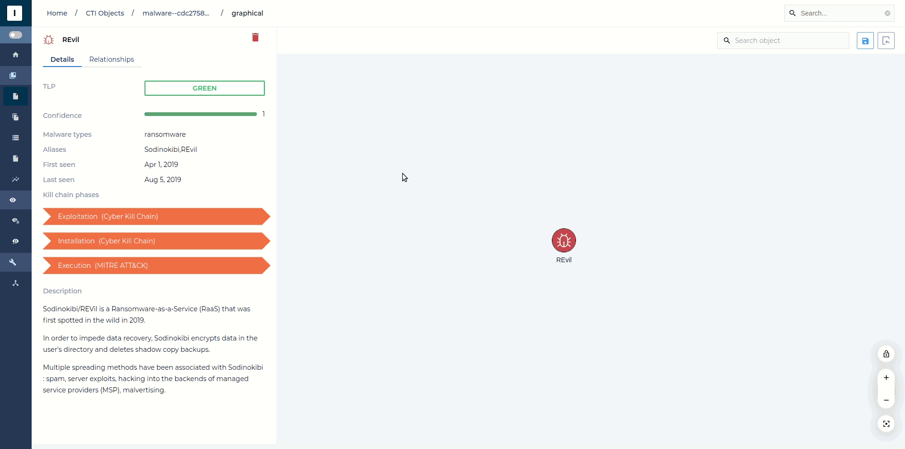
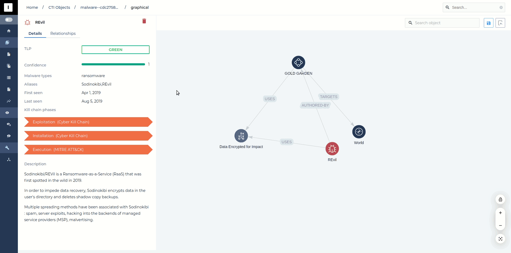
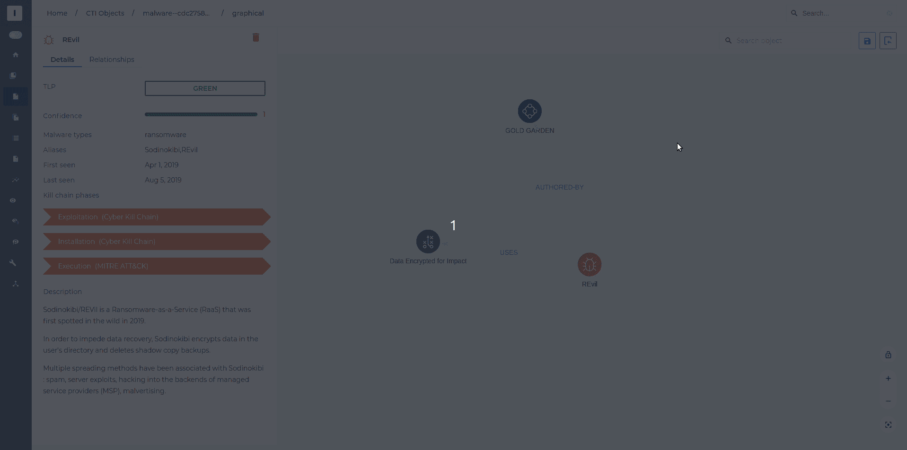

# Graph Explorations

Graph Explorations enables you to select objects and relationships from the knowledge base and add them to a graphical representation that you can then share with your colleagues.

{: style="width: 100%; max-width: 100%"}

## Start an Exploration

You can start a Graph Exploration from any object in the Intelligence Center, by clicking on the "New Graph Exploration" button at the top right of the page.

{: style="width: 100%; max-width: 100%"}

You can also start an exploration from a Report graph.

## Add Relationships

Clicking on any object on the graph displays related information in the side panel. You can also list relationships with the "Relationships" tab. From this list, you can add any relationship to the graph by clicking the hover button.

{: style="width: 100%; max-width: 100%"}

## Remove Items

You can remove relationships from the graph by clicking on the hover button from the relationship list. Objects can be removed by clicking the red trash icon next to their name. Removing a node automatically removes associated relationships.

{: style="width: 100%; max-width: 100%"}

## Save Graph Exploration

Whenever you would like to save a newly created graph exploration, or the changes you made to an existing one, click on the Save button in the toolbar. If this is a creation, you will be prompted for a name.

{: style="width: 100%; max-width: 100%"}

## List saved Explorations

At any time, it is possible to list saved explorations from your community by clicking on the "Graph Explorations" item of the menu. From there, you will be able to dive into saved explorations by clicking on any of them.

{: style="width: 100%; max-width: 100%"}
