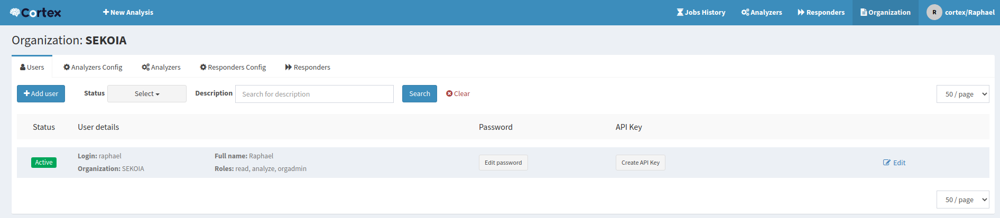
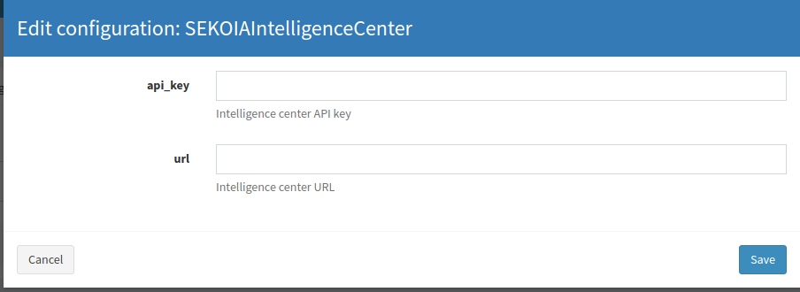

# Intelligence Center external integrations

Intelligence Center data can be consumed using several third party integrations.

## MISP Feed

The default feed is available as a MISP feed.

It can be added to an existing MISP instance by following [MISP's documentation](https://www.circl.lu/doc/misp/managing-feeds/).

The following field values are required for the feed to work properly:

-   Input Source: Network
-   URL: `https://api.sekoia.io/api/v2/inthreat/misp`
-   Source Format: MISP Feed
-   Headers: `Authorization: Bearer <APIKEY>`
-   Enabled: `True`

You then need to make sure you have a scheduled task in place to regularly fetch the feed's content.

## OpenCTI connector

An [OpenCTI](https://www.opencti.io) connector is available to consumme a feed.
All the instruction to run it are available at the connector GitHub repository: https://github.com/OpenCTI-Platform/connectors/tree/master/sekoia.

## Cortex Analyser

SEKOIA is also providing a [Cortex analyzer](https://github.com/TheHive-Project/Cortex-Analyzers/tree/master/analyzers/SEKOIAIntelligenceCenter) to enrich data in [TheHive](https://thehive-project.org/) ecosystem.
To setup the analyzer please [follow this guide](https://github.com/TheHive-Project/CortexDocs/blob/master/analyzer_requirements.md).

In a nutshell:

- Get the SEKOIA.IO API Key
- Install the Analyzer refering to this section of the [TheHive](https://github.com/TheHive-Project/CortexDocs/blob/master/installation/install-guide.md#installation) documentation
- Connect into Cortex with `orgadmin` role
- Select your organization on the top right corner 
{: style="width: 100%; max-width: 100%"}
- Move to `Analyser Config` and search `sekoia` 
{: style="width: 100%; max-width: 100%"}
- Select `SEKOIAIntelligenceCenter`
- Provide simple configurations 
{: style="width: 100%; max-width: 100%"}
- Enable the Analyzer you would like to use, by clicking on the right side 
{: style="width: 100%; max-width: 100%"}
- If wanted, tailor made your Analyzer with additional details
{: style="width: 100%; max-width: 100%"}

## SEKOIA.IO App for Splunk

An App for Splunk is available to detect threats in your logs based on our feed.

You can find the download links and additional information on the dedicated [GitHub repository](https://github.com/SEKOIA-IO/SEKOIA.IO-for-Splunk).

{: style="width: 100%; max-width: 100%"}
