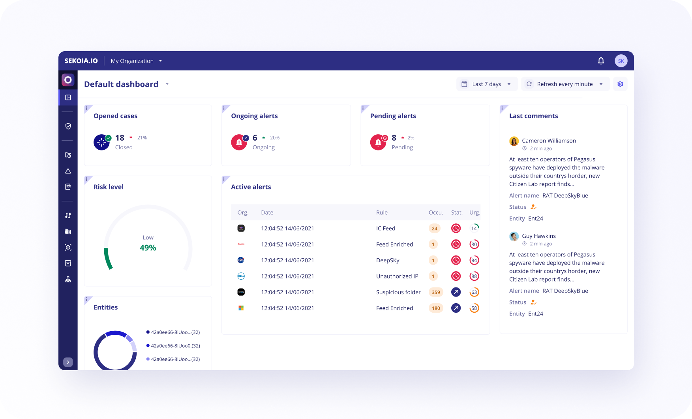

# Dashboards

**SEKOIA.IO’s Operations Center homepage uses a dashboard mechanism that is fully configurable and adaptable to your needs.**

Dashboards are composed of modular widgets that can be placed and edited wherever you want on the screen. Widgets can be fully configured as you can specify the date range, apply filters, change the display, etc...

## Default Dashboard

Accounts on SEKOIA.IO come with a preconfigured dashboard that gives a synthetic view of the current community activity, either from an operational security perspective (risk level, number of alerts, etc.) or from an activity perspective (list of last posted comments, last 
created alerts, etc.).

### Time range and refresh period

You can easily manage the time range and the refresh period of your dashboard by clicking on the selects in the top right of the screen.

## Create a New Dashboard

### Create from scratch

The default SEKOIA.IO's dashboard cannot be edited. However, you can create your own dashboards to meet your specific needs. 

To do so, several widgets are available to you with the possibility to configure and add multiple filters to them. 

To create a new dashboard, you have to: 

1. Go to the Settings button in the upper right of the screen
2. Click on Create a new dashboard 
3. Give your dashboard a name and a description 
4. Save
5. Click on `Add widget` and select a widget from the list in the right panel
6. Drag the needed widget in the workspace and edit it following your needs
7. Save

To access your dashboards, you have to click on the name of the dashboard in the upper left of the screen and choose a dashboard from the list.

!!! note Dashboards you create will be available to all members of your community.

### Duplicate an existing dashboard

You can also create a new dashboard by duplicating an existing one. To do so: 

1. Select the dashboard you want to duplicate
2. Click on the Settings button on the top right of the screen
3. Click on Duplicate this dashboard 
4. Rename your dashboard and give it a description 
5. Edit the widgets you want and change the layout if needed
6. Save your changes.

## Edit and add widgets to a dashboard

To edit a dashboard, you have to: 

1. Go to the Settings button in the upper right of the screen
2. Click on Edit this dashboard 
3. Go to the Settings button
4. Click on ` add widget`
5. Drag widgets to your dashboard
6. Save your changes

## Delete a dashboard

To delete a dashboard, you have to:

1. Go to the Settings button in the upper right of the screen 
2. Click on Delete this dashboard

!!! note The Default Dashboard cannot be deleted.
