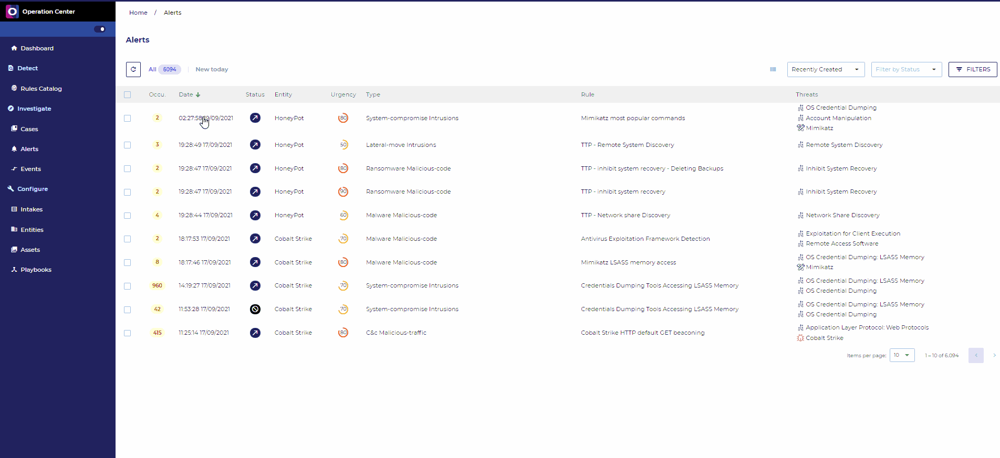
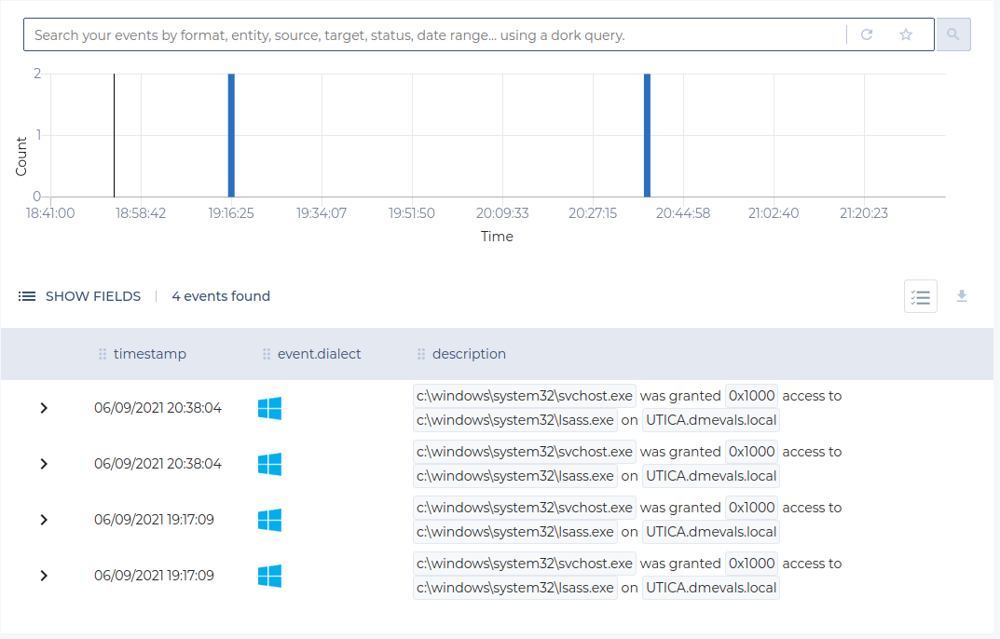
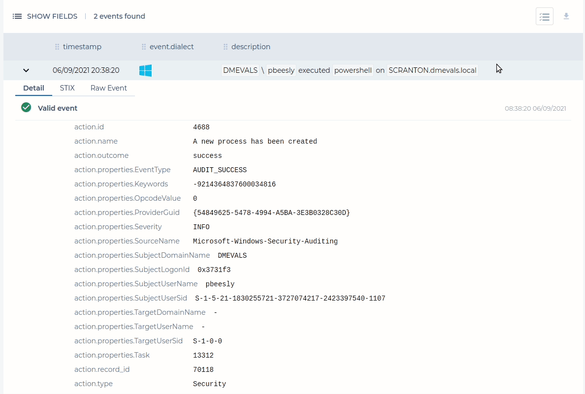
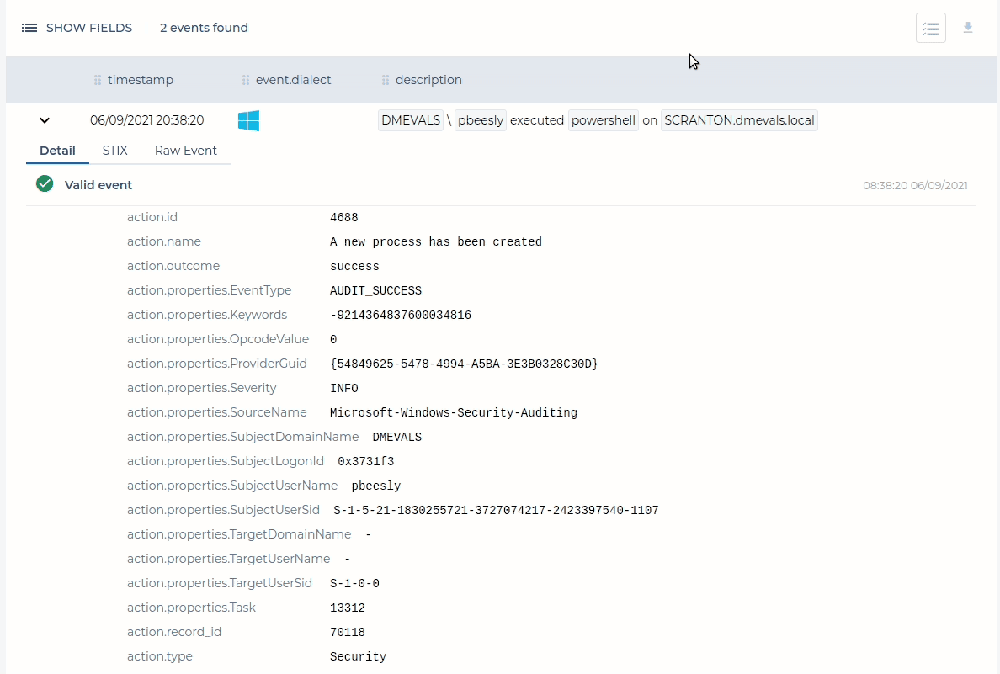
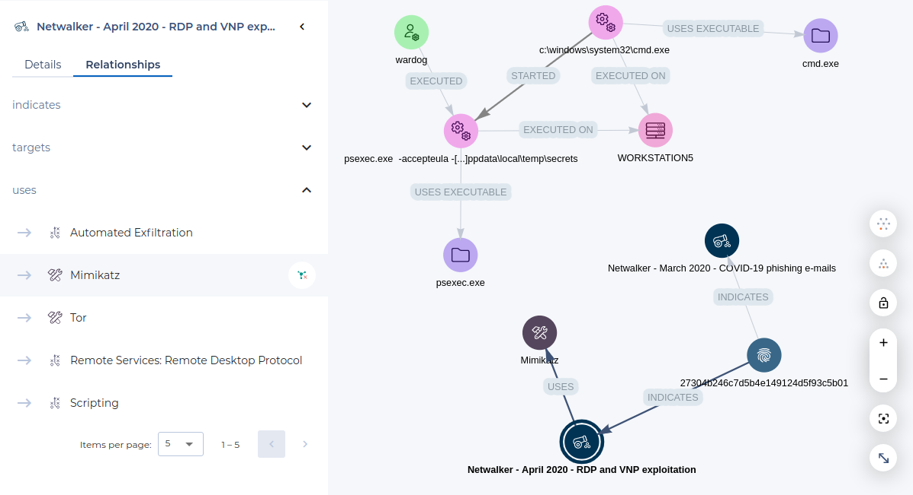
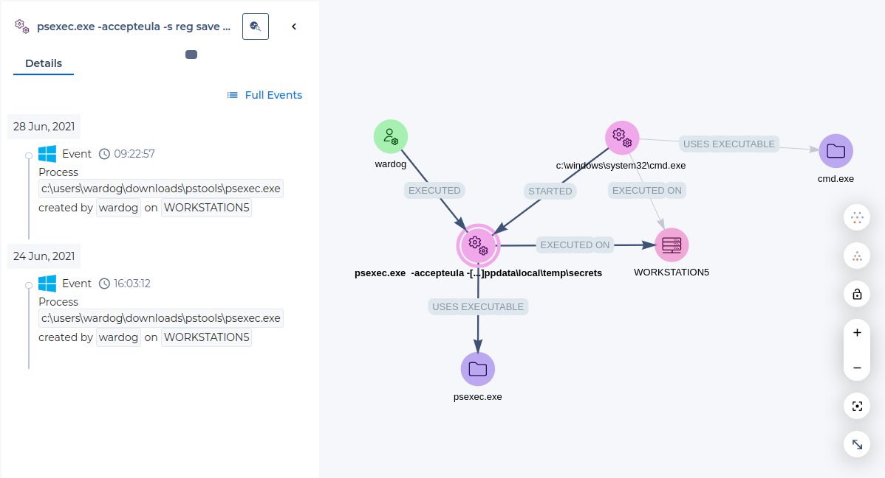

# Alerts Management

Alerts are created by the Operation Center when any threat is detected (when an event matches a rule).

## Concepts

### Alert Status and lifecycle

There is five possible statuses for an alert:

- **Pending**: As soon as an alert is triggered, it is placed in 'Pending' status. If the generation mode for this alert is 'Automatic', this status changes automatically to 'Ongoing'. In other cases, the following actions are accepted: Acknowledge, Reject, Validate.
- **Acknowledged**: This status is used when an analysis is ongoing. If the analyst can decide if an alert is a true or a false positive quickly, this status can be optional, time to acknowledge used in statistics will be set to time to change to Ongoing or Rejected status.The following actions are accepted: Validate, Reject.
- **Ongoing**: Alert is considered as true positive and countermeasures are not yet been applied. This status is the first one seen in case of automatic mode. The following actions are accepted: Close (countermeasures have been applied, no more alert), Reject (after more analysis, this alert was a false positive).
- **Closed**: Every necessary actions have been applied for the alert. This status is a final status, no action accepted.
- **Rejected**: The alert was a false positive. This status is a final status, no action accepted.

{: style="width: 100%; max-width: 100%"}

### Alert Urgency

The Urgency is a number used to give a score to the risk associated with a specific alert. It is calculated from the severity of a rule and the criticality of assets related to the alert.
This gives a value between 1 (very low risk) and 100 (very high risk).
The urgency is provided under two different representations on alert detail: a numerical and a textual representation.

| Display  |  Value   |
| :------: | :------: |
|   Low    |  [0-20[  |
| Moderate | [20-40[  |
|   High   | [40-60[  |
|  Major   | [60-80[  |
|  Urgent  | [80-100] |

### Alert Types and Categories

The Alert Type is associated with the rule, but can be changed with the value associated to specific indicators in case of CTI rules.

The Alert Type is defined according to a custom set of values derived from theReference Incident Classification Taxonomy of ENISA:

- abusive-usage
	- bandwidth-download
	- bandwidth-upload
	- p2p
	- high-drop
- abusive-content
	- spam
	- harmfull-speech
	- violence
- malicious-code
	- virus
	- worm
	- trojan
	- spyware
	- dialer
	- rootkit
	- malware
	- botnet-drone
	- ransomware
	- malware-configuration
	- c&c
- information-gathering
	- scanner
	- sniffing
	- social-engineering
	- portscan
	- sweepscan
	- appscan
- intrusion-attempts
	- ids-alert
	- brute-force
	- exploit
- intrusions
	- privileged-account-compromise
	- unprivileged-account-compromise
	- application-compromise
	- bot
	- defacement
	- compromised
	- backdoor
- availability
	- dos
	- ddos
	- sabotage
	- outage
- information-content-security
	- Unauthorised-information-access
	- Unauthorised-information-modification
- fraud
	- unauthorized-use-of-resources
	- copyright
	- masquerade
	- phishing
- vulnerable
	- vulnerable-service
- other
	- blacklist
	- unknown
	- other
- test
	- test
  - test

## Alert List

When you first connect to SEKOIA.IO, the alerts list will diplay the last 10 alerts raised on your community ordered by Date.
Here is an example of this page populated with various alerts:

{: style="width: 100%; max-width: 100%"}

On this screen, you can observe the following information:

From the left to the right, 7 features are availables on the top screen:

- `Refresh` the page, with new alerts generated (a figure will increment on the button)
- Select `All` existing alerts to be listed
- Select only the `Today`'s alerts
- Change the `column display fields` such as hidding the Entity, or Adding the Source or Target
- Display the alerts by `Most Frequent`, `Recently Updated`, `Recently Created` or `Most Urgent`
- Display the alerts by `Status`
- Use `Advanced filter` capacities, as shown in the picture bellow:

{: style="width: 70%; max-width: 70%"}

On the main alert listing, it is also possible to:
- `Select multiple alerts` in the same time, then choose and apply a massive change of status
- `Filter in` all rules with the same Rule Name
- `Get more information on the Threats` by clicking on it, so you should be redirected on the Intelligence Center focused on this specific Threat

By default, the alert listing displays the following information (**more information on the meaning of these fields is provided after the Alert Details section**):
- A `Selector` so you can perform an action on multiple alerts on the same time
- A `Similarity` counter, showing the alert was raised multiple time for the same reason, rather than simply adding a new line on the alert feed  
- Alert creation `Date`
- Alert `Status`. When hovering over the icon, a frame indicates the status modification date and who modified it
- The `Entity` to which the alert corresponds
- `Urgency` of the alert, between 0 and 100, 100 being the highest
- The `Type` of alert
- The `Name` of the rule which triggered the alert
- The `Threats` related to the alert in termes of malicious activities, related tools, Campaign...

> Your custom configuration will be saved in order to allow you to keep your customer filters when you will come back to this page.

> For Partners, an additional filter is available in order to display all or a subset of alerts related to its managed communities.
> The alert listing also displays the Communities related to the alerts. 

## Alert Details

The Alert Details can be reached by clicking on the line of any alert in the Alert List.
This will provide you with a new view for quick to deep investigations, as shown bellow:

{: style="width: 100%; max-width: 100%"}

The Alert Details header contains the Urgency, the Name and the Alert's Short ID as well as the following actions:

- `Alert Status`: can be used to move the Alert through its lifecycle
- Add to `Case`
- `Playbooks`: display the list of on-demand playbooks and be able to trigger them

{: style="width: 100%; max-width: 100%"}

The different sections of the page are then separated into 4 tabs: `Details`, `Tasks`, `Events` and `Graph Investigation`.

### Details

The Details tab contains the information needed to understand what the alert is about and why it was raised. It is split into two columns.

The first column contains the following items:

- The detailed alert urgency
- The alert type
- The impacted assets
- The impacted entity
- Related cases (cases in which this alert appears)
- The Kill Chain phase
- Details about the rule that was triggered
- Details from the Intelligence Center about all threats linked to this alert

The urgency and kill chain phase can be edited on hover.

{: style="width: 100%; max-width: 100%"}

The second column is the timeline. It contains all items that constitute the history of the alert:

- Alert status changes
- Comments, that can be added with the button at the top right
- Events represented by their Smart Descriptions
- Completed Tasks
- Rejected Tasks

It is possible to filter the timeline to display only items of a certain type.

{: style="width: 100%; max-width: 100%"}

### Tasks

{: style="width: 100%; max-width: 100%"}

The Tasks tabs lists tasks and subtasks that are associated with the alert. Buttons are available to complete or reject tasks. When completing a task, you are informing the Operation Center that you have undertaken the corresponding action on your perimeter. The urgency of the alert will thereby decrease, as well as the risk indicator.

Subtasks can have an OpenC2 specification which can be displayed by clicking on the automation icon.

### Events

{: style="width: 100%; max-width: 100%"}

The Events tab lists the events that raised the alert in a display similar to the [Events page](../events.md).

When interracting with individual values, it is possible to:

- Filter for: only applies to the events that raised the alert
- Filter out: only applies to the events that raised the alert
- [Search events with this value](#search-events-with-this-value)

The "Value Selection" mode can be toggled with the button at the top right of the event list in order to select multiple values in displayed events. The selected values can then be used to:

- [Create and Alert Filter](#create-an-alert-filter)
- [Search events with these values](#search-events-with-this-value)

#### Create an Alert Filter

Alert Filters can be used to prevent known false positives from raising the same alert in the future.

You can create an Alert Filter for the Rule that triggered the alert easily by selecting multiple values and clicking on the Alert Filter button. The filter's pattern is automatically created from selected values.

By default, "Reject the Alert" is selected to automatically reject the alert after creating the Alert Filter.

{: style="width: 100%; max-width: 100%"}

#### Search Events with this value

The "Search Events with this value" feature can be used to perform a search into all events that occured during the alert's timeframe (+- 1 hour). The search query is automatically created from selected values. A side panel opens with the search results, allowing to investigate an alert without leaving its page.

{: style="width: 100%; max-width: 100%"}

### Graph Investigation

The Graph Tab is presenting the analyst with a graphical visualisation of the Alert. The following items appear on the graph:

- Observables: these are automatically extracted from events (IP addresses, Domain Names, URLs, User Account, etc.).
- Observable Relationships: relationships between observables are represented by arrows linking them on the graph. Relationships are extracted from events using the [Smart Description](https://github.com/SEKOIA-IO/Community/tree/main/events) definitions.
- CTI Objects: STIX objects from the Intelligence Center that provide additional context.
- STIX relationships between Threat Objects, as minded bellow:

{: style="width: 100%; max-width: 100%"}

#### Threat Intelligence

You can access Threat Intelligence by clicking on any CTI object on the graph. The left panel will display its description and let you list its known relationships. Related objects can then be added on the graph to pivot into the Threat Intelligence database.

{: style="width: 100%; max-width: 100%"}

#### Observables

You can access Observable Details by clicking on any Observable on the graph. The left panel will display all events inside the alert related to this observable, with their [Smart Description](https://github.com/SEKOIA-IO/Community/tree/main/events). Full Events can be accessed into the right side panel by clicking on "Full Events". It is also possible to [Search events with this value](#search-events-with-this-value) by clicking on the button next to the observable's name.

{: style="width: 100%; max-width: 100%"}
