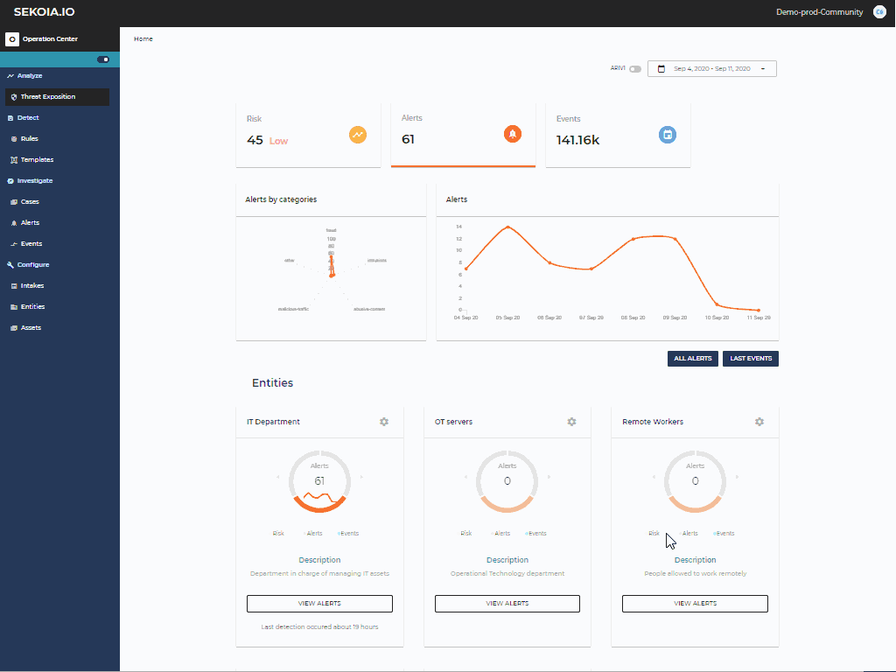

# Cases Management

Cases allow information relating to security records to be shared whith members of your community. A case consists of a title, a description, a severity, and may be associated with alerts from the Operation Center.

A case has a lifecycle (currently, open or closed) and can be assigned to one or more people.

This feature allows, for example, a security supervision team to escalate alerts to another team for clarification or to group alerts that seem related to facilitate analysis.

