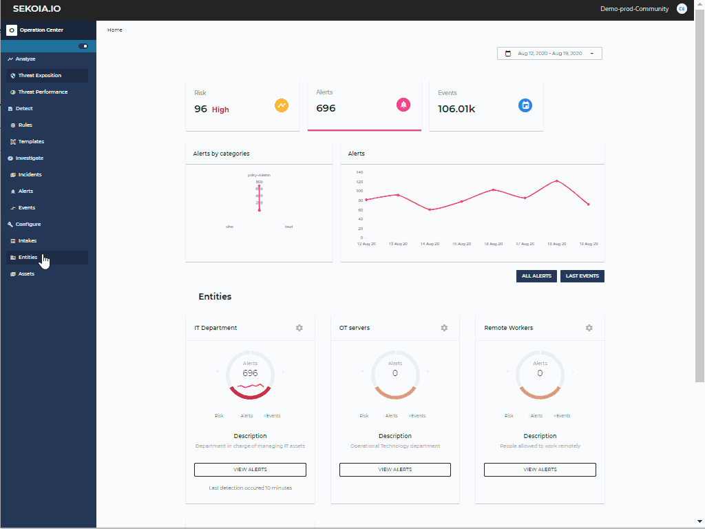

# Entities

Entities allow a logical grouping of your data sources and the associated alerts.  It can be a company site, network zone, or any other grouping that you think is relevant.

All fields of entities are editable and mandatory. The **Alert generation mode** affects the alert processing workflow. There are two generation modes:

- 'automatic', for which the alerts proceed to the status 'Ongoing' immediately after their creation
- 'manual', for which the alerts remain in the status 'Pending' until a manual action.

A default value for alert generation mode is defined for each entity, which can be override in each detection rule.

Under the entity details, you will find the associated data sources. To activate a new intake for your entity, please refer to the [intakes](intakes.md) documentation.

