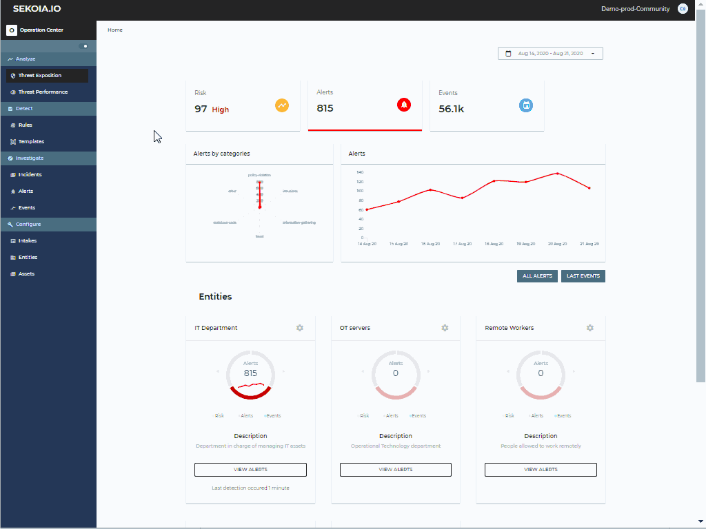

# Events Page

The events page diplays a list of latest events received by SEKOIA.IO. You can search among them by using Dork query langage, for which you can find more information [here](../searching/dork.md).

On the event page, you can access the raw format of your events, as received by SEKOIA.IO and the STIX format in which it is transformed.

## Log list:
The scrolling list displays all the logs you have sent us.
The default columns:
- Timestamp: Event date
- Event.dialect: Type of intake that sent the event.
- Description: Smart description with clickable links formatted by SEKOIA.IO to show the most important elements and make them easily accessible such as (IP Address, Type, Name)

## Log lines:
Each line of log can be unrolled to show:
- Details: Detailed information retrieved from the log about all events once they are parsed and elements related to the intake and community, using the event page searchable format.
- STIX: Event as a STIX bundle that will be used by detection engines.
- Raw event: Event as received.

## Search bar:

### Filters:
It is possible to use and combine filters in the search bar by using:
- Smart description: By clicking on the "+" button.
- Details: The query is made on the existing fields in the "details" section by clicking on the "+" button for one of the items.
To go back to the list of logs, you need to clear filters and select "Current events"

### Save filters:
It is possible to save a query by clicking on the star icon. 
To check it out, you can click on "Saved queries" then select the wanted period of time and press enter to see the events found.

### Date:
It is possible to select the period of time to be taken in consideration for the search by using:
- Presets: Recommended predefined dates.
- Dates relatives: Earliest and latest moments to select.
- Date ranges: Gap between 2 dates.

### Search history:
Each search has a duration in which the results will be saved in the relative date but when it is expired, you still have the possibility of replaying it using the saved relative date.
