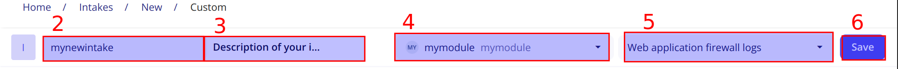

# Custom format

SEKOIA.IO provides a list of intakes that allows you to integrate events from different application and security appliance.

It is sometimes possible that the events you want to put into the platform are not supported by any intake.

The fonctionnality Custom format allows you to easily develop your own Intake. It gives you the tools to parse your events in the Elastic Common Schema (ECS) format so that they are well integrated in the plateform and they can be used to raise alerts.

## Create an empty Custom format

The creation of an empty Custom format is the first step to develop your own Intake.
After that, you will be able to create an Intake and start to send your logs. No event will be parsed but you will be able to check the evolution of your parser while you are developping it.

First of all, go to `Intakes`, `+ INTAKE` and select `Custom format` : 

1. Write the name of your Intake
2. Give a description of your Intake
3. Select a module. A module is a taxonomy in relation with your format which will help you to develop your parser. For instance, if you develop a custom format for a product of Fortinet, you will take the Fortinet module. If your module does not exist, just write the name of your module (name of the application or compagny if they have different products) and click on `Create`
4. Select the data sources associated to your events. You can have severals ones. It will be use when you want to deploy rules since they are linked to data sources.
5. Click on `Save`

{: style="max-width:100%"}


## Stages
A Custom format consists in a sequence of stages organized under a pipeline that modifies the event on the fly.
A stage is a parsing step that will have a specefic behaviour on the event.
The goal is to define a sequence of stages that will parse your events in the ECS format. 

### Common stages
Common stages are provided by SEKOIA.IO to help you parse your events. They are currently 5 differents common stages, each having its specifities :

- Json
- Date
- DSV
- Grok
- KV

#### JSON Stage

{: style="max-width:100%"}

The JSON stage can be used to deserialize a JSON from a string.
You will need the provide :

- Name
- Description (optional)
- Input_field
- Output_field

`Input_field` is the entry of the stage. It corresponds to the field you want to deserialize. It is set to `{{original.message}}` by default. When you start sending your logs in an empty parser, your log will be placed in that field.
`original` refers to the event at the entry of the pipeline and `message` to the field corresponding to the log.

`Output_field` is the output of the stage. It will be used in next stages to get a JSON field.

**Example**

In the following event, a JSON is present in the `message` field. The JSON stage can be used to get all information we need.

```json
{
  "message": "{'protocol':'tcp','traffic':{'source':'127.0.0.1','target':'8.8.8.8'}}"
}
```
To get the reference of the source IP in another stage, we will use the reference `{{stage1.message.traffic.source}}`

- `stage1` is the name of JSON stage
- `message` is the name of the `Output_field`
- `traffic.source` is the field we want in the JSON

#### Key Value
{: style="max-width:100%"}

The Key-Value stage can be used to deserialize a key-value string.
You will need to provide :

 - Name
 - Description (optional)
 - Input_field
 - Output_field
 - Value Separator
 - Item Separator

`Input_field` is the entry of the stage. It corresponds to the field you want to deserialize. It is set to `{{original.message}}` by default. When you start sending your logs in an empty parser, your log will be placed in that field.
`original` refers to the event at the entry of the pipeline and `message` to the field corresponding to the log.

`Output_field` is the output of the stage. It will be used in next stages to get a value corresponding to a key.

`Value Separator` is the separator that divides the key from the value. It it set to `=` by default. 

`Item Separator` is the separator that divides two different key-value. The default separator is `/s` which means any whitespace character.

**Example**

In the following event, a key-value string is present in the `message` field. The Key-Value Stage can be used to get all information we need.

```json
{
  "message": "to=john.doe@example.com, relay=mail.isp.com, delay=xxx, delays=xxx, dsn=2.0.0, status=sent (250 2.0.0 OK)"
}
```

With `Value Separator: "="` and `Item Separator: ",\s"`, the log can be parsed. To get for example the relay, we will use the reference `{{stage1.message.relay}}`

- `stage1` is the name of the Key-Value stage
- `message` is the name of the `Output_field`
- `relay` if the key corresponding to the value we want

#### Grok
{: style="max-width:100%"}

The Grok stage can be used to match a field against a Grok pattern. Grok is a tool provided by Elasticsearch and allows you to parse arbitrary string and structure it.
You can find more information about Grok in the [official documentation](https://www.elastic.co/guide/en/logstash/current/plugins-filters-grok.html).
The list of all the Grok patterns that can be used can be found [here](https://github.com/elastic/logstash/blob/v1.4.0/patterns/grok-patterns)

`Input_field` is the entry of the stage. It corresponds to the field you want to deserialize. It is set to `{{original.message}}` by default. When you start sending your logs in an empty parser, your log will be placed in that field.
`original` refers to the event at the entry of the pipeline and `message` to the field corresponding to the log.

`Output_field` is the output of the stage. It will be used in next stages to get a value corresponding to a key.

`Pattern` is the Grok pattern.

If no Grok pattern satisfies your need, you can also create your custom Pattern

**Example**
In the following event, a Grok Stage can be used to parse the event.

```json
{
  "message": "64.3.89.2 took 300 ms"
}
```

If we want to parse the IP and the time in milliseconds, we can write the following Pattern :
`%{IP:client} took %{NUMBER:duration} ms`

To get the IP in a next stage, we will then use the reference `{{stage1.message.client}}`

#### Date
{: style="max-width:100%"}


The Date stage can be used to parse a date field. This stage accepts, as optional properties, the format to parse the date (by default, the stage try to autodetect the format) and the IANA timezone of the parsed date (by default, "UTC").

You will need to provide :

 - Name
 - Description (optional)
 - Input_field
 - Output_field
 - Format (optional)
 - Timezone (optional)

`Input_field` is the entry of the stage. It corresponds to the field you want to deserialize. It is set to `{{original.message}}` by default. When you start sending your logs in an empty parser, your log will be placed in that field.
`original` refers to the event at the entry of the pipeline and `message` to the field corresponding to the log.

`Output_field` is the output of the stage. It will be used in next stages to get a value corresponding to a key.

`Format` is the format of the date. You can find additionnal information about the format in the [Oracle documentation](https://www.elastic.co/guide/en/logstash/current/plugins-filters-grok.html)

`Timezone` is the timezone of the date. Default is `UTC`.

**Exemple**

In the following event, a Date stage can be used to parse the field.

```json
{
  "date": "May 21, 2021 at 11:04:35"
}
```

One can configure the stage as follow :

- `Input_field: original.date`
- `output_field: date`
- `format: %MMM %dd, %yyyy at %hh:%mm:%ss`
- `timezone: America/New_York`

To get the date parsed in a next stage, we will then use the reference `{{stage1.date}}`. The output will be in `ISO 8601` format which is the format needed to insert date on the platform.
In this example, the output will be `2021-05-21T11:04:35Z`


#### Delimiter Separated Values
{: style="max-width:100%"}

The Delimiter Separated Values stage can be used to extract values from a delimiter-separated values string. This stage needs the list of columns and, as optional, the delimiter (by default, the delimiter is the comma ',').

You will need to provide :
 - Name
 - Description (optional)
 - Input_field
 - Output_field
 - Column Names
 - Delimiter (optional)

`Input_field` is the entry of the stage. It corresponds to the field you want to deserialize. It is set to `{{original.message}}` by default. When you start sending your logs in an empty parser, your log will be placed in that field.
`original` refers to the event at the entry of the pipeline and `message` to the field corresponding to the log.

`Output_field` is the output of the stage. It will be used in next stages to get a value corresponding to a key.

`Column Names` are the column names used to retrieve information. The format has to be the following : `<column_A>,<column_B>,<column_C>...`

`Delimiter` is the delimiter between values. By default `,`

**Example**

In the following event, a DSV stage can be used to parse the `message` field.

```json
{
  "message": "2020/12/04 16:47:48;LOGIN;jenkins;2305"
}
```

One can configure the stage as follow : 
- `Input_field: original.message`
- `Output_field: message`
- `Column Names: date,action,username,user_id`
- `Delimiter: ;`

To get for instance the `user_id` in a next stage, we will use `{{stage1.message.user_id}}`


### Custom stage

The custom stage is used to create actions. An action is an elementary operation that can `set`, `translate` or `delete` a field.
While your custom stage is empty, you only need to provide a `Name` for the stage.

#### Set
{: style="max-width:100%"}

This action is used to Set the value of one field in the ECS format in the final version of the event.
The field in the final version of the event can be specified with a dooted path (i.e. `field1`, `field1.sub-field2`, ...)

The value can either be a constant (for instance `my-constant`, `10` ...) or a reference to the value of another field in the stage (for instance `{{stage1.message.myfield.subfield}}).
If the value cannot be computed or is empty, the field is not modified.

**Example**

The JSON stage (`Name: parsed_json`, `Output_field: message`) was previously used to parse the following event : 
```json
{
  "message": "{'protocol':'tcp','traffic':{'source':'127.0.0.1','target':'8.8.8.8'}}"
}
```
We now want to put the `source` and the `target` in the final version of the parsed event.
The `Set` action can be used :

{: style="max-width:100%"}

`source.ip` and `destination.ip` are the fields used in Elastic Common Format.

#### Translate
{: style="max-width:100%"}

The `Translate` action sets value of one or more fields according to the value of a source field and a dictionary that connect values.
An optional `fallback` value can be defined. If the value of the source field doesn't match any entry of the mapping dictionary, the fallback value will be used to set the target field. If no fallback value is defined and the value of the source field doesn't match any entries, the target field will not be created in the final event.

**Example**

We want to set the value of `http.response.status_message` according to the value `http.response.status_code` and a dictionary.
`http.response.status_code` contains only status codes values.

We can define a `Translate` action with the following parameters :
{: style="max-width:100%"}

#### Delete
{: style="max-width:100%"}

The `Delete` action allows you to delete fields in the final version of the event.

**Example**

The following action will delete the fields `source.ip` and `destination.ip` from the final event.
{: style="max-width:100%"}

### Filters

Reference to another field can be extended with filters.
Filters are separated from the field path by a pipe symbol (|).
Multiple filters can be chained. The output of a filter is applied to the next.

For example, `{{stage1.username |strip |upper}}` removes the whitespace and returns the uppercase value of the `username` variable computed in `stage1`.

The following built-in filters are available:

| filter       |  description
|---------------|------------------------------------------------
|`abs`          | returns the absolute value of the variable.
|`capitalize`   | returns the first character uppercase, all others lowercase.
|`float`        | converts the variable in float
|`int`| converts the variable in int
|`length`| returns the number of items
|`lower`| returns the value all lowercase
|`max`| returns the largest item from the variable
|`min`| returns the smallest item from the variable
|`strip`| returns the variable removed from heading and leading whitespaces
|`upper`| returns the value all uppercase