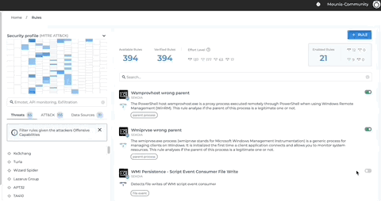

# Detection Rules Management - Coming soon

## Rules Catalog:

### Security profile MITRE ATT&CK

The MITRE ATT&CK framework is a comprehensive matrix of tactics and techniques used by threat hunters and defenders to better classify attacks and assess an organization's risk.
Every time you enable a rule, it appears on the Framework in blue in one or many cells.
Each cell represents an attack technique. The cells are clickable and enable you to see or disable the rules activated in each one.
You can see how many rules are enabled in a cell by hovering over it.
The color changes depending on the number of rules activated in one cell. The blue gets darker when more rules are enabled and a white cell means that no rule is activated in it.

{: style="max-width:60%"}

### Rules attributes

**Typology:**

Two types of rules are displayed on the Rules Catalog.

*Available rules*: All custom rules created by you in addition to the available rules in the Rules Catalog.

*Verified rules*: Rules created by SEKOIA.IO’s analysts, related to the CTI and available in the Rules Catalog.

**Effort level:**

The effort level is increasing from Elementary to Master according to two criteria:

- Effort needed to enable a rule.
- Risk of false positives.

Master rules are generic and raise a lot of alerts, which need to be contextualized in a more refined way. Whereas elementary rules require less effort and raise relatively fewer alerts.
The blue square represents a clickable counter of activated rules, it is therefore possible to use the filters related to the effort level by clicking on one or more of them.

**Capabilities:**

The rules are related to different elements according to offensive and defensive capabilities. They can be related to threats, attacks and data sources.
Each element is associated to a filter that can be used to display the rules related to the selected element.

{: style="max-width:60%"}


### Manage existing rules

**Filters:**

There are different filters linked to all rules attributes above. They can be used either separately or in addition to other filters and allow you to Enable or Disable all rules displayed simultaneously.

**Rules details:**

On top of the details of a rule, you can see the name, when it was released and last updated.
There are information about the effort level attributed to the rule, the severity, tags that ease search, related threats.
It also explains the followed strategy and gives information about false positives, STIX patterning and data sources.
To edit an existing rule, click on the gear icon to select entities and assets, or to add a filter alert. 

{: style="max-width:60%"}


### Add a custom rule

In addition to the rules available in the catalog provided by SEKOIA.IO, you can add your own rules.

- **General definition of the rule:**
The rule name is mandatory during the creation, it will be used to name the corresponding raised alerts by default. You can add an optional description bellow.
Select the effort level required and the threats detected with this rule if any, by selecting it on from the MITRE ATT&CK or by using the search bar through key words or drop-down list.

- **Entities & Assets:**
You can select entities and assets manually or use all of them as a basis to filter the analyzed events.
Detection rules can be applied to all events, whatever the entity to which they are attached or the assets to which they can be linked, or applied only to some of them. 
If you choose 'Using all entities' and 'Using all assets', rules will be applied to all events even if new entites or new assets were added since last rule modification. 
For rules for which some entities or some assets were selected, if new entities or new assets are created, detection will not occur on corresponding events without rule modification.

- **Detection patterns:**
The signature part corresponds to the rule itself, the detection pattern applied to events. There are two type of rules: CTI or correlation.
  
  For CTI rules, you just have to select the source of the indicators: SEKOIA Intelligence Feed is an IOCs feed managed by SEKOIA's Purple Team (indicators present in the SEKOIA.IO Intelligence Center).
  
  For correlation rules, SEKOIA.IO supports two languages : [SIGMA](rules_catalog.md#sigma) and [STIX Patterning](rules_catalog.md#stix-patterning). More details about these languages are given below.```

- **Security alerts:**
In the Alert properties part, you should indicate the category and type of the alerts raised by the rule and the severity of the rule, which is used to calculate the urgency of the corresponding raised alerts in association with assets criticality for events matching assets.

{: style="max-width:60%"}


!!! note
    Modification of rules parameters will be applied for new alerts, raised after the compilation of the rule.

## Sigma Format
Sigma is a generic and open format available to write correlation rules. 
The rule format is easy to write and applicable to any field available in ECS in the platform. The langage used is YAML.

The structure is the following :
```
detection:
  <Search-Idenfier>
    <string-list>
    <field:value>
  <Condition>
``` 

`<Search-Identifier>` is a unique identifier that will be used in `<Condition>`. A `<Search-Idenfier>` can contain two different structures, lists and maps.

!!! Note
    Currently, we set a limitation and rules can be written for only one event. Aggregation expressions are not supported yet.
    
For the full specification of SIGMA, please refers to the [SIGMA Github](https://github.com/SigmaHQ/sigma/wiki/Specification)

### Lists
A list contains one or more strings that will match the full event log. Multiple strings will be linked with a logicial `OR`.

**Example** : Raise an alert when an event contains "DangerousThreat.exe" or "powershell.exe malicousfile.ps1"
```
detection:
  keywords:
    - DangerousThreat.exe
    - powershell.exe maliciousfile.ps1
condition: keywords
```

### Maps
Maps consists of key/value pairs, in which the key is a field in ECS (Elastic Common Format). ECS is the format you can see in the `Details` tab in the `Events` page.
Multiple key/value within the same map are linked with a logical `OR` while two different maps are linked with a logiciel `AND`.

**Example** : Raise an alert when an event contains `event.type: allowed` and the destination IP is either `destination.ip: 1.2.3.4` or `destination.ip: 4.3.2.1`
```
detection:
  selection:
    - event.type: allowed
      destination.ip:
      - 1.2.3.4
      - 4.3.2.1
condition: selection
```

### Value Modifiers
The values contained in Sigma rules can be modified with modifiers. Value modifiers are appended after the field name with a pipe character `|` and can be chained.
Here is some common modifiers :

* `startswith`: the value is expected at the beginning of the field's content. (replaces e.g. 'adm*')
* `endswith`: the value is expected at the end of the field's content (replaces e.g. '*\cmd.exe')
* `re`: value is handled as a regular expression.
    
    **Example**: To write a regular expression for the field `host.domain`, we can write `host.domain|re: <Regular_expression>`


### Conditions
The condition will define how the rule will be processed and the link between the different `<Search-Identifier>`.
We can write the condition using the following expressions :

- Logical AND/OR.

    **Example**: `selection1 or (selection2 and selection3)`

- `1/all of them`

    `1 of them` will link all the `<Search-Identifier>` with a logicial OR.

    `all of them` will link all the `<Search-Identifier>` with a logical AND.

- `1/all of <Search-Identifier>`

    `1 of <Search-Identifier>` will link all the alternatives within the `<Search-Identifier>` with a logical OR. 

    `all of <Search-Identifier>` will link all the alternatives within the `<Search-Identifier>` with a logical AND.

- `1/all of <Search-Identifier-Pattern>`

    It is the same as `1/all of them` but restricted to the Pattern defined. The pattern is written with wildcards `*` which means any number of characters.

    **Example** : Let's suppose we have 4 `<Search-Identifier>`, `selection1`, `selection2`, `selection3` and `pattern`. The condition can be `1 of selection* and pattern`.

- Negation with `not`

    **Example**: `selection1 and not selection2`

!!! Note
    Pipe in conditions are not supported since it is deprecated by the format.


## STIX Patterning

Correlation rules are written using STIX Patterning.

In order to enhance detection of possibly malicious activity on networks and endpoints, a standard language is needed to describe what to look for in a cyber environment. STIX, abbreviation for Structured Threat Information eXpression, is a standardized language developed by MITRE and OASIS Cyber Threat Intelligence (CTI) Technical Committee to describe information about cyber-threats. It has been adopted as an international standard by various communities and organizations sharing information.

STIX Patterns are composed of multiple building blocks, ranging from simple key-value comparisons to more complex, context-sensitive expressions. The most fundamental building block is the Comparison Expression, which is a comparison between a single property of a Cyber Observable Object and a given constant using a Comparison Operator. As a simple example, one might use the following Comparison Expression (contained within an Observation Expression) to match against an IPv4 address:

```
[ipv4-addr:value = '127.0.0.1']
```
Observation Expressions are contained in square brackets [ ... ] and may consist of one or more Comparison Expressions joined by Boolean Operators. Observation Expressions may be followed by one or more Qualifiers, which allow for the expression of further restrictions on the set of data matching the pattern. The final, highest level building block of STIX Patterning combines two or more Object Expressions via Observation Operators, yielding a STIX Pattern capable of matching across multiple STIX Observed Data SDOs.


!!! warning
    Currently, we set a limitation and only rules matching with single Observed Data, and so using only one Observation Expression contained in square brackets, are available for our customers.

!!! note
    When matching an Observation against an Observation Expression, all Comparison Expressions contained within the Observation Expression _MUST_ start matching against the same SCO in the Observation. That is, when resolving object paths of each Comparison Expression, the `<object-type>:<property_name>` _MUST_ start from the same SCO. Different SCOs may ultimately be used in matching, but they MUST be referenced from the same, single SCO.

    An Observation Expression _MAY_ contain Comparison Expressions with Object Paths that start with different object types, but such Comparison Expressions _MUST_ be joined by `OR`. **The Comparison Expressions of an Observation Expression that use `AND` MUST use the same base Object Path**.

!!! note
    Regarding the use of regular expressions (`MATCHES` keyword) in STIX Patterning rules, it is necessary to escape the “`\`”. Thus, the STIX Patterning rule to identify countries other than France, you will need to use the following rule:

    ```
    [ipv4-addr:x_tags[*].name MATCHES '^country:(?!FR)\\w+']
    ```

For more information about STIX and STIX Patterning, please refers to the [OASIS STIX Patterning specification](http://docs.oasis-open.org/cti/stix/v2.0/stix-v2.0-part5-stix-patterning.html).
### How to Validate STIX Patterning Rule’s Syntax

SEKOIA.IO checks the syntax of submitted rules and reports errors to the “rules” interface.

In order to validate your rule’s syntax, you can also use an open source tool called [`stix2-patterns`][stix2-pattern-github]. This tool is part of the official tools developed by the OASIS Technical Committee.

Here’s an example on how to use that tool. These commands should be executed in a shell.

```
$ python3 -m venv venv
$ source venv/bin/activate
$ pip install stix2-patterns
$ validate-patterns
Enter a pattern to validate: [ipv4-addr:x_tags[*].name MATCHES '^country:(?!FR)\\w+']

PASS: [ipv4-addr:x_tags[*].name MATCHES '^country:(?!FR)\\w+']
```

In this example, we are trying to validate a STIX Patterning rule that contains a regular expression (`MATCHES`). This rule is considered valid and can be submitted to SEKOIA.IO.

[stix2-pattern-github]: https://github.com/oasis-open/cti-pattern-validator
### How to Test STIX Patterning Rules?

When one creates a rule in SEKOIA.IO, this one is automatically validated and applied to incoming traffic.

In order to test your STIX Patterning rules, you can use an open source tool, called [`stix2-matcher`][stix2-matcher-github]. This tool is part of the official tools developed by the OASIS Technical Committee.

First, you need to retrieve a STIX “bundle” from SEKOIA.IO. To do so, go to the “events” page, find the event you want to work on, and export the STIX representation of that event:


Export that STIX “bundle” in a file, called, for example, `event.json`.
Here’s an example on how to use that tool. These commands should be executed in a shell. We are also using [`jq`][jq] a tool that helps to manipulate JSON files.

```
$ python3 -m venv venv
$ source venv/bin/activate
$ pip install stix2-matcher
$ cat event.json | jq '.objects[] | select( .type | contains("observed-data") )' > observed-data.json
$ cat << EOF >| patterns
[ipv4-addr:value = '246.127.189.32']
[x-dns-traffic:extensions.'x-log'.hostname = 'hostname']
EOF
$ stix2-matcher -f observed-data.json -p patterns

MATCH:  [ipv4-addr:value = '246.127.189.32']

MATCH:  [x-dns-traffic:extensions.'x-log'.hostname = 'hostname']

```

[stix2-matcher-github]: https://github.com/oasis-open/cti-pattern-matcher
[jq]: https://stedolan.github.io/jq/

## Observed Data

In order to trigger alerts, rule patterns must match with Observed Data. An "Observed Data" is the internal representation of any collected event in SEKOIA.IO. All events are normalized into a JSON object compliant with the STIX Observed Data specification. Detection rules are applied on events in STIX Observed Data format.

Here is an example of an Observed Data that could be obtained from a squid event:

```json
{
    "x_sic_entity_by_ref": "identity--d6358bb4-d9bb-47aa-b074-c6d1aeb673e2",
    "created": "2019-09-20T16:17:42.971Z",
    "objects": {
        "0": {
            "value": "127.0.0.1",
            "type": "ipv4-addr"
        },
        "1": {
            "value": "216.58.215.48",
            "type": "ipv4-addr"
        },
        "2": {
            "start": "2019-09-20T16:17:40.935Z",
            "type": "network-traffic",
            "end": "2019-09-20T16:17:40.935Z",
            "extensions": {
                "http-request-ext": {
                    "request_header": {
                        "Content-Type": "application/xml"
                    },
                    "request_method": "HEAD",
                    "request_value": "http://216.58.215.48/"
                }
            },
            "src_ref": "0",
            "dst_ref": "1",
            "protocols": [ "ipv4" ]
        },
        "3": {
            "type": "user-account",
            "extensions": {
                "x-log": {
                    "hostname": "DESKTOP-UPU7IFP"
                }
            }
        }
    },
    "type": "observed-data",
    ...
	"x_event_type": "http"
}
```
The JSON object has a type of **observed-data** and is composed by smaller objects following another STIX specification: **Cyber Observables**.

The main observable is the third one, with a type of network-traffic. It has references to indicate the source of the packet (`src_ref` - `127.0.0.1`) and its destination (`dst_ref` - `216.58.215.48`).

These information can be used to construct correlation rules. Below, a non-exhaustive list of information which can be used in your rules:

- `ipv4-addr:value`
- `ipv6-addr:value`
- `domain-name:value`
- `url:value`
- `network-traffic:dst_port`
- `network-traffic:src_port`
- `network-traffic:dst_packets`
- `network-traffic:src_packets`
- `network-traffic:dst_ref.value` (corresponding to IP value, in the above example, network-traffic:dst_ref refers to object 0, which has a value of '127.0.0.1')
- `network-traffic:src_ref.value`
- `network-traffic:extensions.'http-request-ext'.request_value`
- `network-traffic:protocols[*]`
- `process:pid`
- `process:name`
- `process:command_line`
- `file:hashes.md5`
- `user-account:account_login`
