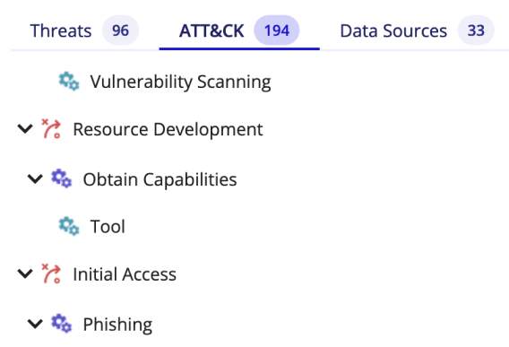

# Detection Rules Management

Once your event logs are collected and normalized by SEKOIA.IO, you probably want to leverage them to detect suspicious activity within your perimeter. Rules contain the detection logic that determines when Alerts should be created.

All rules are applied to your event stream in real-time, so that you can detect - and respond to - threats as fast as possible.

## Rule Types

SEKOIA.IO supports the following rule types:

- **Sigma**: signature rules using the [Sigma detection language](#sigma-rules)
- **CTI**: rules based on Indicators Of Compromise (IOCs) coming from a Threat Intelligence feed. These rules automatically detect thousands of known malicious indicators (such as domain names, URLs, IP addresses, etc.). A CTI rule "SEKOIA Intelligence Feed" is already built-in to detect malicious activity based on a list of indicators from SEKOIA.IO's own Intelligence feed, continuously updated by our Threat & Detection Research team
- **STIX** (deprecated): signature rules using the STIX Patterning language

## Rules Catalog

The Rules Catalog page can be used to list and manage all detection rules. Many filters are available and can be combined to easily find the rules you are looking for.

You can enable or disable rules one by one are all at once according to current filters.

{: style="max-width:100%"}

### Rules Attributes

#### Available / Verified Rules

The Rules Catalog lists all detection rules available to your organization:

- **Verified Rules**: rules created for you by SEKOIA.IO's Threat & Detection Research team and already built-in. This set of more than 500 rules can be used to detect known threats, attack patterns, etc. Verified rules are constantly updated to improve detection.
- **Custom Rules**: rules created by your team that are specific to your organization.

The Available Rules counter displays the total number of rules (verified + custom). You can click on the Verified counter to list only Verified rules. You can then click on the Verified filter if you would rather see only Custom rules.

{: style="max-width:100%"}

#### Effort Level

All rules have an associated effort level. The effort level is increasing from Elementary to Master according to two criteria:

- Effort needed to enable a rule.
- Risk of false positives.

For example: 

- **Elementary** rules require almost no effort and raise fewer alerts.
- **Master** rules are generic and raise a lot of alerts that will require qualification, but they can detect weaker signals. Those rules require an additional customisation effort, which has to be adapted to the customer context.

You can click on each counter associated with an effort level to see only the rules for this level.

{: style="max-width:100%"}

#### Capabilities

The rules are also associated with different capabilities:

- Offensive Capabilities: **threats** or **attack patterns** that they can detect
- Defensive Capabilities: **data sources** on which they operate

Capabilities that have associated rules inside the catalog are listed on the left of the page. You can click on any Threat, Attack Pattern, or Datasource to list only rules that are associated with it.

{: style="max-width:100%"}

### Security Profile (MITRE ATT&CK)

The MITRE ATT&CK framework is a comprehensive matrix of **tactics** and **techniques** used by threat hunters and defenders to better classify attacks and assess an organization's risk.
Every time you enable a rule, it appears on the matrix in blue in one or many cells.
Each cell represents an attack technique. The cells are clickable and enable you to see or disable the rules activated in each one.
You can see how many rules are enabled in a cell by hovering over it.
The color changes depending on the number of rules activated in one cell. The blue gets darker when more rules are enabled and a white cell means that no rule is activated in it.

{: style="max-width:100%"}

### Rule Details

You can click on the name of a rule to display additional details, such as, but not limited to:

- The Severity which should be used to later determine the Alert's Urgency
- The Category of created alerts
- Associated Threats
- Associated Data Sources
- Known False Positives
- The actual detection logic (the pattern)

{: style="max-width:100%"}

### Limiting the scope of a rule

When the Rule Details panel is open, you can click on the Configure icon at the top right to edit the rule's configuration. If the rule is Custom, you will be able to edit every aspect of it. Otherwise, you will only be able to limit its applicable scope with the following filters:

- **Alert Filters**: are additional patterns that you can add to any rule to exclude matching events. This is useful to exclude known false positives so that your detections are always spot on. It is often easier to create Alert Filters [directly from an Alert](../alerts/#create-an-alert-filter).
- **Entities**: select the entities this rule should apply to. By default, rules apply to all entities.
- **Assets**: select the assets this rule should apply to. By default, rules apply to all assets.

When rules have limited scope with selected entities or assets, these rules will not automatically apply to new entities or assets that are later created.

{: style="max-width:100%"}

### Create custom rules

In addition to the verified rules that are already built-in, you can create your own rules to support other detection use cases. To create a rule, click on the + Rules button at the top right of the page and fill out the form.

The Rule creation form has the following sections:

- **General definition of the rule:**
  The rule name is mandatory during the creation, it will be used to name the corresponding raised alerts by default. You can add an optional description below.
  Select the effort level required and the threats detected with this rule if any, by selecting it from the MITRE ATT&CK or by using the search bar through keywords or the drop-down list.

- **Detection Pattern:**
  This is the detection logic itself. It varies according to the selected rule type.

- **Security alerts:**
  In the Alert properties part, you should indicate the category and type of the alerts raised by the rule and the severity of the rule, which is used to calculate the urgency of the corresponding raised alerts in association with assets criticality for events matching assets.

  You can also pre-select fields that will be displayed inside alerts to speed up alert qualification.

- **Entities & Assets:**
  As discussed in the [limiting the scope](#limiting-the-scope-of-a-rule) section, you can select specific entities or assets this rule should apply to.

{: style="max-width:100%"}

### Automatically enable new rules

New verified rules are created regularly. You may not want to look at the rules catalog daily to decide if you want to enable them or not. By clicking on the configure icon at the top right of the Rules Catalog page, you can configure which rules should be automatically enabled for your organization.

Rules are automatically enabled based on the configured effort level, or you can decide to never automatically enable rules.

{: style="max-width:100%"}

## Sigma Rules

Sigma is a generic and open format you can use to write signatures that will be applied to your event stream in real-time. This format makes it easy to write rules applicable to any field available in normalized events. Rules are documents using the YAML format.

### Detection Object

Each rule should contain a `detection` object using a set of `Search-Identifier`s to define a matching `condition`:

```yaml
detection:
  <Search-Idenfier>
    <string-list>
    <field:value>
  condition: <Condition>
```

`<Search-Identifier>` is a unique identifier that will be used in `<Condition>`. A `<Search-Idenfier>` can contain two different structures: **Maps** and **Lists**.

#### Maps

Maps consist of key/value pairs in which the key is the name of a field in your normalized event. The value is the value that should be present in this field for the `Search-Identifier` to match. Several values can be specified at once, in which case they are joined together with a logical `OR`.

The keys of a map are joined together with a logical `AND`.

**Example** : Raise an alert when an event contains `event.type: allowed` and the `destination.ip` is either `1.2.3.4` or `4.3.2.1`

```yaml
detection:
  selection:
    event.type: allowed
    destination.ip:
      - 1.2.3.4
      - 4.3.2.1
  condition: selection
```

#### Lists

A list contains one or more items that are joined together with a logical `OR`.

Lists of strings can be used to define any string that should be present in the whole event `message`:

**Example**: Raise an alert when an event contains `DangerousThreat.exe` or `powershell.exe maliciousfile.ps1`

```yaml
detection:
  keywords:
    - DangerousThreat.exe
    - powershell.exe maliciousfile.ps1
  condition: keywords
```

You can also use lists of maps to combine several maps with a logical `OR`.

**Example**: Raise an alert when a specific IP address is seen as a source or a destination:

```yaml
detection:
  selection:
    - source.ip: 6.6.6.6
    - destination.ip: 6.6.6.6
  condition: selection
```

#### Values

Some things to know about values used in Sigma rules:

- All values are treated as case-insensitive strings
- You can use wildcard characters (`*` means any number of characters, `?` means any one character)
- You don't have to escape characters, except `'`, `*` and `?`. A single backslash `\` does not need to be escaped, but can be (`\` is the same as `\\`)
- You can use `''` to define an empty value
- You can use `null` to define a null value

#### Value Modifiers

The values contained in Sigma rules can be modified with modifiers. Value modifiers are appended after the field name with a pipe character `|` and can be chained.

Here is the list of supported modifiers:

- `contains`: puts \* wildcards around the values, such that the value is matched anywhere in the field
- `all`: link values of a list with a logical `AND`
- `base64`: match the value encoded with Base64
- `endswith`: the value is expected at the end of the field's content (replaces e.g. `*\cmd.exe`)
- `startswith`: the value is expected at the beginning of the field's content. (replaces e.g. `adm*`)
- `re`: the value is a regular expression. Regular expressions are case sensitive by default
- `cidr`: the value is a subnet in CIDR notation (e.g. `192.168.1.0/24`) the IP address should belong to
- `lt`: less than this value
- `lte`: less than or equal to this value
- `gt`: greater than this value
- `gte`: greater or equal to this value 

**Example**: Raise an alert when the URL matches specified regex and the command line contains all specified values

```yaml
detection:
  selection:
    url.original|re: ".*(php|aspx)$"
    process.command_line|contains|all:
      - evil_arg1
      - evil_arg2
      - evil_arg3
  condition: selection
```

#### Condition

The `condition` defines how `Search-Identifier`s should be combined to determine if the rule matched.

It supports the following expressions:

- Logical `AND`/`OR`

  **Example**: `selection1 or (selection2 and selection3)`

- `1/all of them`

  `1 of them` will link all the `Search-Identifier`s with a logical OR.

  `all of them` will link all the `Search-Identifier`s with a logical AND.

- `1/all of <Search-Identifier-Pattern>`

  It is the same as `1/all of them` but restricted to the Pattern defined. The pattern is written with wildcards `*` which means any number of characters.

  **Example** : Let's suppose we have 4 `Search-Identifier`s: `selection1`, `selection2`, `selection3` and `pattern`. The condition can be `1 of selection* and pattern`.

- Negation with `not`

  **Example**: `selection1 and not selection2`

### Correlation

Detection objects apply a signature to a single event to determine if there is a match. What if you want to create more complex signatures that would require several events to match? You can do this with Sigma Correlation rules.

Sigma Correlation rules are also Yaml documents that allow the expression of aggregations and relationships between `detection` objects.

A correlation document has the following attributes:

- `action` set to `correlation`
- `type` is the [correlation type](#correlation-types)
- `rule` refers to one or multiple Sigma rules or correlations (allowing definition of chains of correlations) defining events to be correlated
- `group-by` optionally defines one or multiple fields which should be treated as separate event occurrence scope (example: count events by user)
- `timespan` defines a time period in which the correlation should be applied (such as `5m` or `1h`)

Further fields might be required depending on the correlation type.

#### Correlation Types

##### Event Count (`event_count`)

Counts events matching a given detection `rule` during the specified `timespan`, grouping events by the optional `group-by` fields. An alert is created when the count matches the specified `condition`.

**Example**: Raise an alert when a `user.name` fails to log in more than 5 times in the space of 5 minutes.

```yaml
name: login_failed
detection:
  selection:
    event.category: authentication
    event.outcome: failure
  condition: selection
---
action: correlation
type: event_count
rule: login_failed
group-by: user.name
timespan: 5m
condition:
  gte: 5
```

##### Value Count (`value_count`)

Counts the number of unique values in a field defined by `field`. Only events matching a given `rule` during the specified `timespan` are considered. Events are grouped by the optional `group-by` fields. An alert is created when the count matches the specified `condition`.

**Example**: Raise an alert when a `user.name` fails to log in to more than 5 different `log.hostname` in the space of 5 minutes.

```yaml
name: login_failed
detection:
  selection:
    event.category: authentication
    event.outcome: failure
  condition: selection
---
action: correlation
type: value_count
rule: login_failed
group-by: user.name
timespan: 5m
field: log.hostname
condition:
  gte: 5
```

##### Temporal Proximity (`temporal`)

All events defined by the rules referred to by the `rule` field must occur in the time frame defined by `timespan`. The values of fields defined in `group-by` must all have the same value. If the bool value `ordered` is set to `true`, events should also occur in the correct order.

**Example**: Raise an alert when a `user.name` uses two common reconnaissance commands in quick succession on the same host.

```yaml
name: quser
detection:
  selection:
    process.command_line|startswith: quser
  condition: selection
---
name: dir
detection:
  selection:
    process.command_line|startswith: dir
  condition: selection
---
action: correlation
type: temporal
rule:
  - quser
  - dir
group-by:
  - user.name
  - log.hostname
timespan: 1m
ordered: false
```

#### Conditions

The field `condition` defined the condition that must be met to raise an alert. It operates on the count resulting from and `event_count` or `value_count` correlation. It is a map of exactly one condition criteria:

- `gt`: the count must be greater than the given value
- `gte`: the count must be greater than or equal to the given value

#### Chaining

Correlation rules can be chained together to create even more complex detection logic. This means the `rule` attribute of a correlation document can refer to another correlation rule.

**Example**: Raise an alert when a `user.name` fails to log in more than 5 times on the same host and then succeeds, within 10 minutes.

```yaml
name: login_failed
detection:
  selection:
    event.category: authentication
    event.outcome: failure
  condition: selection
---
name: login_success
detection:
  selection:
    event.category: authentication
    event.outcome: success
  condition: selection
---
name: many_failed_logins
action: correlation
type: event_count
rule: login_failed
group-by:
  - user.name
  - log.hostname
timespan: 10m
condition:
  gte: 5
---
action: correlation
type: temporal
rule:
  - many_failed_logins
  - login_success
group-by:
  - user.name
  - log.hostname
timespan: 10m
ordered: true
```

#### Grouping events from different fields

In some cases, you may want to correlate events from different sources of information that have the `group-by` value in different fields. In that case, you can use the `aliases` document to specify which fields should be considered for each `rule`.

**Example**: Raise an alert when a successful login is followed by a new network connection with the same couple `source.ip`, `destination.ip`.

```yaml
name: login_success
detection:
  selection:
    event.category: authentication
    event.outcome: success
  condition: selection
---
name: new_network_connection
detection:
  selection:
    event.category: network
    event.type: connection
    event.outcome: success
  condition: selection
---
action: correlation
type: temporal
rule:
  - login_success
  - new_network_connection
group-by:
  - internal_ip
  - remote_ip
timespan: 5m
ordered: true
aliases:
  internal_ip:
    login_success: destination.ip
    new_network_connection: source.ip
  remote_ip:
    login_success: source.ip
    new_network_connection: destination.ip
```
