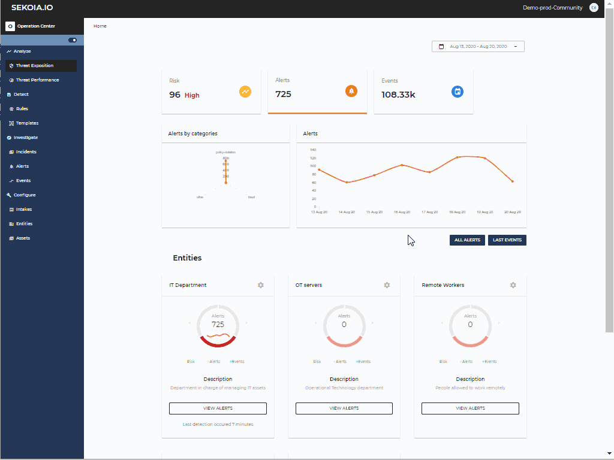

# Rule Templates

Part of a rule's information can be stored in Templates, which can then be applied to new rules.
Templates will have the name of the 'templated' rule by default.
Information that will be copied in a new rule are:

- Type of the rule: correlation or CTI
- Signature of the rule
- Type of the alert that will be triggered by the corresponding rules
- Severity of the rule

