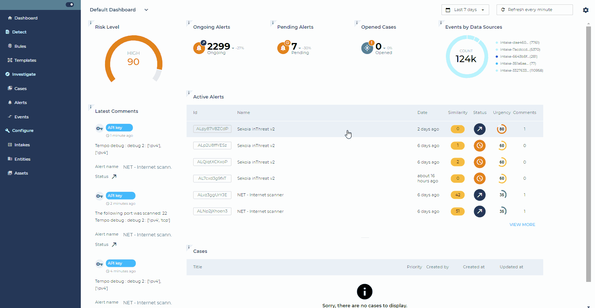
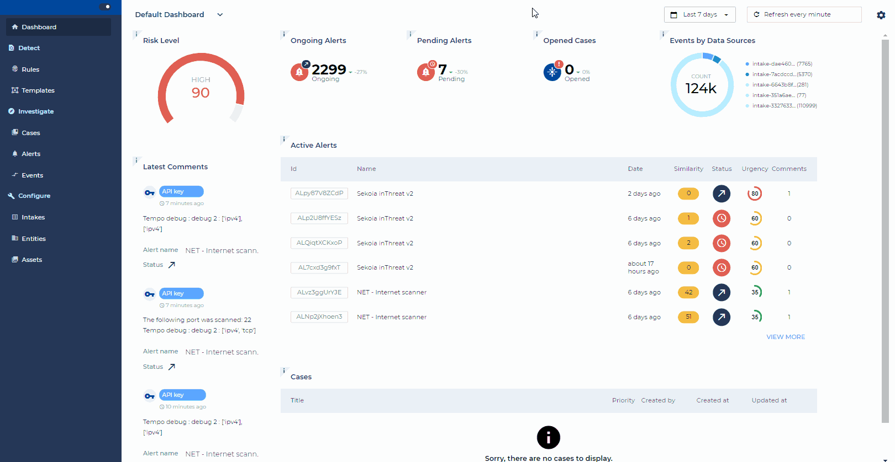
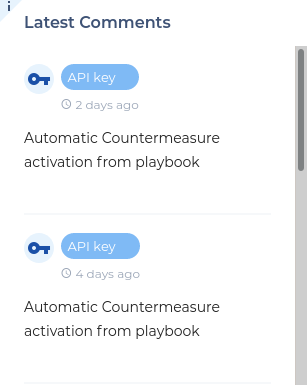

# Dashboards

**SEKOIA.IO’s Operation Center brings a dashboard mechanism, that is fully configurable and adaptable to all needs.**

Dashboards are composed of modular widgets that can be placed where you want. Widgets can be configured to specify the date range, applied filters, display, etc.

## Default Dashboard

SEKOIA.IO comes with a pre-configured dashboard that gives a synthetic view of the current community activity, either from an operational security perspective (risk level, number of alerts, etc.) or from an activity perspective (list of last posted comments, last created alerts, etc.).

Several of these widgets allow quick access to the relevant elements in the Operation Center.

You can manage easily the time range you want to display and the refresh period of your dashboard in the top right of the screen.

## Create a New Dashboard

The default dashboard offered by SEKOIA.IO cannot be modified.

In addition to this, you have the possibility of creating your own dashboard, in order to match it as best as possible to your uses.

Several widgets are available to you, with the possibility depending on the chosen widget to configure various filters.

!!! note
    Dashboards you create will be available to all members of your community.

You also have the possibility of creating a new dashboard by copying an existing dashboard, as well as the possibility of editing all the dashboards outside the “Default Dashboard”.

## Provided Widgets

SEKOIA.IO’s Operation Center provides several widgets:

| Widget Name                         | Description                                                                                                            | Screenshot                                                                 |
|-------------------------------------|------------------------------------------------------------------------------------------------------------------------|----------------------------------------------------------------------------|
| **Alerts**                          | List of alerts, optionally filtered by their status and sorted either by their urgency, their frequency, etc.          |                |
| **Number of Alerts**                | Count the number of alerts, optionally filtered by their status and by their associated entity                         |              |
| **Risk Level**                      | Global risk level (ARI) for the current community                                                                      |                   |
| **Cases**                           | List of cases, optionally filtered by their status and sorted either by their urgency or they last updated date.       |                 |
| **Number of Cases**                 | Count the number of cases, optionally filtered by their status                                                         |               |
| **Number of Events by Data Source** | Number of events collected by source of data displayed as a list, a doughnut or an histogram.                          |       |
| **Entities Overview**               | List synthetic view of entities with for each one the risk level, number of alerts and the number of collected events. |         |
| **Last Comments**                   | List of comments posted on items such as alerts or cases.                                                              |         |
| **Top Observed Threats**            | Show list threats (malware, tool or attack-pattern) observed in alerts.                                                |  |
