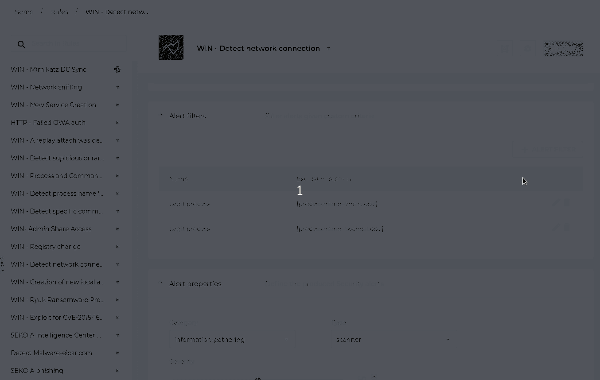
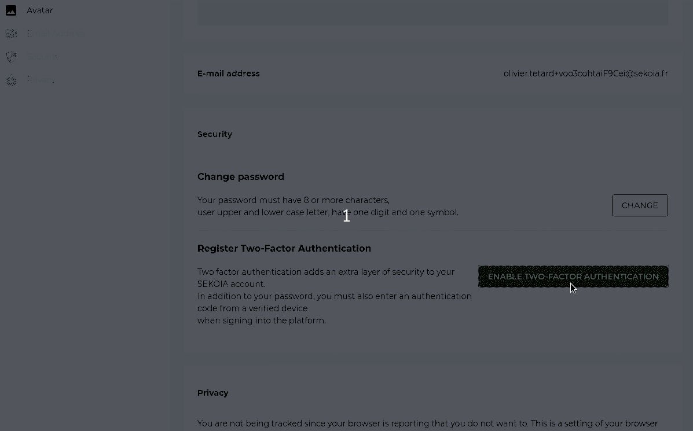
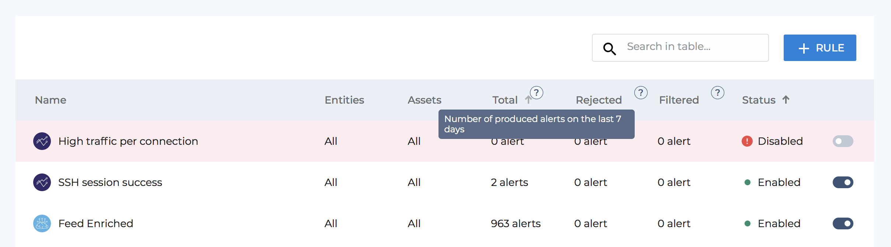

kind: release

## 22/07/2020

### Improved display of « Observed Data » on alert page
Work on the detail page of an alert continued, always with the aim of facilitating the analysis of an alert and minimizing the presence of « noise » on the page.

#### Differentiated display according to the types of SCO (STIX Cyber-observable Objects)
The objects (SCO) that make up an « Observed Data » now have a separate display according to their type. Thus, an object of type network-traffic is better laid out and some extensions, such as  http-request-ext, are displayed in a more readable way.

#### Display of raw events formatted in JSON
It is now possible to display the raw events in a dedicated window from the display of an «Observed Data». If the raw event is in JSON format, then the latter is formatted to make it easier to read.

### Adding and modifying « Alert Filters »
When developping detection rules, it is now possible to add and modify « Alert Filters ». These filters, written in STIX patterning, make it possible to prevent the raising of alerts when certain criteria are met by an « observed data ». In the example below, the rule is used to raise an alert as soon as network traffic is detected by sysmon and the « alert filters » are used to indicate which are the legitimate processes to carry network traffic, for which there must be no raised alert.

### Two-factor authentication
You can now activate two-factor authentication to strengthen the security of your user account on SEKOIA.IO. All you have to do is go to the management page of your user account (accessible by clicking on the icon at the top right of the application, choose 'Settings'). As a second factor of authentication, you can use a TOTP (time-based one-time password) application such as Google Authenticator, Authy, LastPass Authenticator or 1Password.

## 07/07/2020

### Improvement of the display of  "Observed Data" on Alert page

Significant work has been done on the display of the detail elements of an alert. The work mainly focused on “Observed Data”, which corresponds to the SEKOIA.IO internal representation of all the events collected.

Here is the new display of an Observed Data:

#### Metadata of an "Observed Data"
A new block has been added at the top of the screen to display the metadata associated with an "Observed Data". It is thus possible to distinguish at first glance the type and format of the observed data, its relative date, as well as the entity for which the observation was made.

Several redundant or technical information has been removed from this display area, but it is still possible to access all of the raw "Observed Data" information by clicking on the icon '<>'.

#### Display of objects associated with "Observed Data" (SCO)
Various changes have been made to the display of SCOs in an Observed Data. SCOs are the “STIX Cyber-observable Objects”, corresponding to the observable details objects, such as IP addresses, domain names, ports, file names, e-mail addresses, etc.

SCOs involved in raising the alert are now highlighted in blue and unrolled by default. We can therefore understand the alert more quickly and start analyzing it immediately.

In addition, any “tags” associated with SCOs are displayed directly on the title of the SCO. These “tags” correspond to enrichments by SEKOIA.IO of the events received. A flag icon is displayed in place of the text for the “tags” designating countries.

#### Raw events
Raw events, as sent by your systems, are now available directly on the page describing an "Observed Data".

Full raw event is available by clicking on icon '<>'.

## 14/02/2020

This release page is now part of our newly designed website SEKOIA.IO on which you can find all the information about our products (presentation, use cases, pricing...) as well as a documentation and our contact if needed.

### Detection Rules

There are some major changes that happened to the rules' page. First, we've added five new columns (entities, assets, total of produced alerts, rejected alerts and filtered alerts in the last 7 days) to add more context and comprehension to each rule. We've also put a toggle button on each row to quickly **enable** or **disable** a rule if needed. CTI and Correlation icons act now as the rule type's indicator, and if there is a compilation error, it can be clearly visible in the Status column (it's all red, you can't miss it).

By clicking on a rule, we are redirected to a rule's main page which also got a radical makeover.
A secondary menu is now visible on the left with all the rules listed as well as their current status to ease the navigation and prevent the user from having to go back to the rules table. A new banner is displayed at the top with the rule's main information like the name, type, and last update as well as an action button sticked on the right. Six collapsable sections are hanging under it to accommodate our users' needs to configure their rules as they please.
We've included a new feature in the rule creation: **alert filters**, which enables our users to filter alerts given custom criteria by specifying an exclusion pattern.
And last but not least, it is now possible to create a rule without a template, to save a rule configuration as a template and to use a pre-existing template to fill out information about a rule!

### Events page
Before, we used to list only the last 50 events gathered by our intakes. Now, you can scroll indefinitely in your last events list, but also look for something specific in your events by using the [dork language](https://docs.sekoia.io/searching/dork/).

### Intakes
Speaking of which, you can now see all of your intakes listed in a separate page with all the information you need to make sense of them. In addition to the intake format and intake key, you can now see the events and errors produced by the intake. If you haven't already, take a look at our on-going list of [integrations](https://docs.sekoia.io/integrations/) and let us know if you don't find the format you're looking for. We can make them available for you. :-)

### User Center
To enhance our users' experience on the platform, we created the "User Center". From there, it is possible to manage your profile as well as your numerous communities, members, roles, API keys, and delegations. You can access it through the contextual menu on the upper right of your screen.

## 18/06/2019

### The Fresh New UI

At SEKOIA.IO, we feel committed to ensuring that our users have the best experience in terms of navigation and usability. This is why we are excited to announce the new UI as the first step of our long list of user interface enhancements.

### Main Menu Navigation

The first thing we’ve changed has to do with the **overall navigation** on the platform. We’ve moved the main menu which was on the right to a bigger, more intuitive and more responsive one on the left, putting all the sections of the platform in one place to give the user a direct access to every functionality of our platform. The sticky menu will automatically expand when hovering over it, but users can choose to keep it open or close it by using the new Hamburger button “Keep Open”. Even if it is reduced, a set of icons will still be visible, making it easier to navigate from one page to the other.

On top of each page, a **breadcrumb** has been integrated to let users know how one page is nested within other pages and to provide them with direct links to previous pages without having to bother with the back button.

_Before_

_After_

Another change has to do with the **display** of the different tables on the platform. As you know, at SEKOIA.IO we use many complex tables with a lot of data on them. To draw the user's eye to the data that matters most, we've decided to make these tables responsive and thus taking a wider place on the screen depending on what kind of device the user is on. We also got rid of the blue border on the left of each table which used to distract from the data in those tables, and we changed some buttons and icons to have a more consistent design all over the platform.

_Before_

_After_

_We would like to inform our users that this upgrade will not degrade any existing functionality and does not require upgrade costs or system requirement changes._

If you have any concerns, feel free to contact us at [support@sekoia.io](mailto:support@sekoia.io).

## 06/05/2019

Because we care about your experience on our platform and we want to make it easier for you to track all of your cyberdefense operations, we are happy to announce the launch of our newest feature on SEKOIA.IO: the **Security Performance** dashboard.

**Security Performance** is a key performance indicator (KPI) screen that allows users to assess, measure and evaluate the proper functioning of the Security Operations Center and all the defense operations happening on the platform.

Thanks to a selection of performance indicators, users can visually enjoy a follow-up on the different parameters (rules/alerts/...) while being able to measure the impact of their decision-making in real time.

From a technical point of view, the Security Performance is a board where graphs, figures and metrics are listed to track performance and progress while making sense of all the security performance measures.

The data provided on Security Performance is available through the fresh Statistics API and its new endpoints listed in [this documentation](https://docs.sekoia.io/api?id=4).

Here are the main performance indicators available on the Security Performance feature:

- **Number of new alerts.**

- **Number of new incidents.**

- **Backlog line** shows the proportion of alerts that have been processed or completed.

- **Auto processed alerts** refers to the proportion of automatically processed alerts.

- **Reaction Time** displays the average time to start processing an alert.

- **Rules** refers to the number of detection rules that have been triggered.

- **Alert Workflow Duration** shows the time needed to acknowledge and investigate an alert upon the creation of this one.

- **Precision map** indicates the proportion of alerts validated by the operators compared to those rejected. It’s an estimation of the accuracy of users’ rules.

- **Time to close** shows the average time necessary to close/resolve an alert.

- **Operators’ Activity** traces all actions performed by human operators.

- **Time to resolution by severity** helps operators distinguish between the most severe alerts and the less important ones by displaying severity and the time needed to resolve each one.

- **Alert by category** shows the most frequent categories of alerts.

If you have any concerns, feel free to contact us at [support@sekoia.io](mailto:support@sekoia.io).

## 25/01/2019

This major release brings a large set of new features and bug fixes that improve the configuration, the detection and the qualification of security alerts.

### Inboarding
We redesigned the inboarding process to simplify its execution and reduce frictions.

A 7-day free trial period is made available at try.sekoia.io for new members. This trial can be extended up to 25days if the user validates trophies that are destributed along traditionnal user path. A contextual menu offers a precise vision of both validated and not validated trophies.

The landing page of SEKOIA.IO has been refreshed to improve the user experience and promote the new usages of the platform.

### Configuration
The user can define the list of the probes he/she wishes to connect to SEKOIA.IO. The intake feature automates the ingestion of events produced by connected probes. This version brings seven different supported formats of probes: Suricata, OpenSSH, HAProxy, Nginx, Netfilter, Squid.

### Detection
A new detection engine is introduced with this version: the threshold engine. This major feature enables the creation fo rules to detect telemetric variations on both the number, the volume and the frequency of the events.

### Qualification
The data model for an alert has been expanded to explicitly link a comment to a state change of the alert. This feature has been introduced so that a user can explain and justify any modification he/she introduced on an alert.

A better description of an alert, the associated attack and its structure is offered to the user through the visualization of the estimated step in the Cyber KillChain the alert denotes.

### Reporting
New metrics are offered to the user to improve his understanding of its orchestration. Among these indicators, we can cite the reporting of the type of handled events.

The Alert Risk Indicator computation process has been updated to ease its comprehension. The computation is now performed on at most 10 days and only ongoing, closed and rejected alerts are considered.

The new statistics API replaces the Stats API to provide a broader set of new counters, datasets and key risk indicators.

If you have any concerns, feel free to contact us at [support@sekoia.io](mailto:support@sekoia.io).

## 03/12/2018

This release brings a set of major features such as the support for the Delegation of permissions and the first components of a new SIC detection engine

### SIC Application
Profile pictures are very helpful elements in our interfaces. It allows SIC operators to easily know who did an action and gain some details on the underlying reasons. A simple but really effective optimization was done on our web pages to reduce the number of queries needed to retrieve profile pictures.

A SIC operator can preset the severity of a rule through its definition in its related template.

Ingested events are enriched with a short description, a source and a target. A SIC Operatior can leverage these information to get a clear and concise definition of the events that triggered the alert he is reviewing.

A SIC operator can request a notification with the content of the alert for every updates made on an alert (new comments, status changes, counter-measure updates, …). This notification is sent through the EventsAPI and is available as a stream.

Two assets can now share the same name to support any naming strategy followed by the user.

### SEKOIA.IO
There are avatars, API keys, and applications that require access to data and actions from other communities. To address this need, we added a Delegation mechanism to our APIs. A community can delegate a set of permissions to avatars or API keys of another community. The delegation is revocable at any time and community administrators can audit all delegations in their communities. A validity deadline can be set when creating the delegation.

SEKOIA.io database architecture is now based on a central database, hosted on multiple replicated servers. This release brings an automatic server failure detection to trigger the re-election of the principal database among the available databases thus improving our SLOs.

If you have any concerns, feel free to contact us at [support@sekoia.io](mailto:support@sekoia.io).

## 29/10/2018

This release provides new investigation features for SIC operators to optimize their workload while improving the quality of their analysis.

### SIC Application
#### New page to display either sources or targets implied in alerts
In order to qualify alerts, SIC operators need to have more information about nodes involved in an alert. The new “source/target” page allows one to gain insights on a node. In addition to statistics such as the number of alerts raised by that node or the number of referenced incidents, It also provides the list of the most meaningful alerts and incidents that leads to that node.

#### Bulk actions on alerts
SIC operators often apply the same treatment to multiple alerts, for example to change their statuses. To enhance user experience, the ability to perform bulk actions on alerts. This features speeds up the work of SIC operators by avoiding the repetition of the same operation several times. It allows operators to focus more deeply on alerts.

### SEKOIA.IO
#### Enhanced datastore performances and resiliency for Docker Swarm servers
All our virtual machines, which includes servers that are taking part of the Docker Swarm cluster, stores their data on “datastores”. In order to improve resiliency and performance from an I/O perspective, we have added new datastores. This means that if one of the datastore is overloaded, this won’t have a negative impact on the whole platform.

If you have any concerns, feel free to contact us at [support@sekoia.io](mailto:support@sekoia.io).

## 15/10/2018

This release brings many improvements on the alert contextualization processes and threats descriptions for better insights on the threats your assets are facing.

### InThreat Application
Faster and more reliable indexation of our Cyber Threat Intelligence indicators. inThreat is Sekoia’s Cyber Threat Intelligence (CTI) solution. One of its mission is provide a knowledge base related to cybercrime and cyberthreats which is fed by our collectors and by our users. To ensure the best operational capacity for this database, we perform a complete and structured indexing of all of the observation collected. Such operation is expensive, hence, to ensure the best user experience, we implemented asynchronous indexing of the collected CTI observations as proposed in the TAXIIv2 standard.

Improved threat descriptions of our CTI indicators. Our Cyber Threat Intelligence knowledge base is used, amongst others, by SIC, the detection solution implemented on SEKOIA.IO. To ease the understanding of our indicators by all of our users, we have improved the description related to malwares, threat related tools and attack patterns. This let final users understand precisely the impact of an alert. Enhanced descriptions are well formatted, free of technical terms and contextualized with information regarding to their provenance.

### SIC Application
#### Detection rules applied to multiple entities
SIC security engines rely on user defined rules to perform their detection that apply to a given set of supervised entities. To simplify the day-to-day work of SIC operators, this release enables the creation of detections rules that easily apply to multiple entities. This new feature drastically reduces the required effort to create and maintain a fine grained-based detection strategy.

#### New “rule statistics” page in the SIC frontend
Recently, SIC introduced statistics about detection rules. A new page that leverages these new metrics was designed to help SIC operators to improve their detection ruleset. Among others, this page introduces a detailed graph that shows how the number of alerts evolves given a period of time and if the rule raised high urgency alerts.

### Hosting
#### New backup monitoring system
Backup is a very important point for our infrastructure that must provide a way to quickly recover from any crash situation or retrieve erroneously removed data. To enhance the confidence we have in our database level backups, a new monitoring mechanism was developed from scratch. This monitoring allows our operational teams to be notified if one of our backup job failed to proceed automatically so they can intervene and dramatically reduce the risk of any data loss.

If you have any concerns, feel free to contact us at [support@sekoia.io](mailto:support@sekoia.io).

## 08/10/2018

This release focuses on the SIC application with performance improvements and enhanced statistics to empower users in creating fine-grained based detection rules.

### SIC Application

SIC security engines rely on user defined rules to perform their detection. These latter needs to be analyzed and adjusted by the teams running SOCs in order to enhance accuracy of raised alerts. To assess rules efficiency, the statistics API of the SIC application was improved to report more details on the effectiveness of detection rules. One can now assess the quality of its ruleset by querying how many alerts were raised given a rule and a specified time period.

In addition to the quality of the detection, we also expect our engines to process security events on a real time basis. We significantly optimized our sighting generation process used by our correlation mechanisms to reduce the overall analysis duration. One more step forward our objective of a 1s processing time.

As said before, we want to ensure high speed processing events and avoid bottlenecks across our engines. We have added new metrics to help us monitor any lag that could appear between the various components of our workflow. Hence, it helps us to identify if one particular component of the SIC workflow needs to be scaled up to provide more treatment capacity.

### Resiliencies
A lot of our services rely on databases which have a sensible impact on the global responsiveness of the platform. In order to always maintain high performances on our databases, we reduced the amount of I/O on highly sollicited disks. We implemented this major change by adding new hard drives for data that doesn’t require low latency (backups are a good example of such data).

If you have any concerns, feel free to contact us at [support@sekoia.io](mailto:support@sekoia.io).

## 01/10/2018

This release focuses on the SIC application with more collaboratives features and resiliency.

### Collaborative Applications

A neat example of two applications that collaborate for a better user experience is the relationship between inThreat and SIC applications. We increased this collaboration by referencing inThreat indicators in the alert produced by SIC.

A SIC operator can easily query the inThreat CTI database to improve his comprehension of a threat.

Another illustration of such collaboration is the SIC “action card”. This new feature allows one to easily do actions based on a clicked data, such as filter the current display, create a new incident or query the inThreat application to trigger an investigation process.

### Resiliencies

We updated our alert management tool to handle system and business alerts sent by our monitoring system. Besides, we took the opportunity to upgrade the entire monitoring and alerting systems to the latest upstream versions.

We improved the overall security and stability of the platform by enabling continuous delivery of security and system updates on all of our servers.

If you have any concerns, feel free to contact us at [support@sekoia.io](mailto:support@sekoia.io).

## 24/09/2018

This release focuses on the SIC application with a shiny new statistics API and a set of resiliency improvements.

### Features
We followed the quote “Everything is Data and Everyone needs it Analyzed” while implementing out new statistical API for the SIC Application. This brandly new architecture leverages a time series database to expose various counters, risk indicators and datasets on both alerts and events production.

This release brings various improvements on our OpenC2 language support in SIC. Among them, we improved the countermeasure descriptions through the use of fine grained-based action-steps.

### Fixes
SIC customers interconnect their exporters to our detection engines by means of VPN connections. In order to reduce the impact of the various connection failures we encountered the last few days, we improved the overall resiliency of our VPN interconnections by means of a fast and automatic failover mechanism.

We want to bring features and fixes to our customers as fast as possible while ensuring the quality of our products. One of our bottleneck in our release process was data migration on large sets of data. This release comes with our first data migration process which could be run as background tasks.

### Resiliencies
Our APIs are the foundations of our collaborative applications. This release puts under constant monitoring all our HTTP endpoints to track number of requests and their execution times.

A Service Level Objective (SLO) is the key element of a Service Level Agreement (SLA) as it defines the measurement process. This release introduces and actively monitors the first SLO of SEKOIA.IO: our HTTP APIs success rate.

Belt and suspenders! Our new shiny alert management system, based on Prometheus, provides a faster outage notifications mechanism.

### Forecasts

In SIC, we identified the need for a faster way to evaluate the operational impact of a detection rule. We designed a new page to expose statistics and aggregated information on all the alerts and incidents that are related to a selected rule.

A key feature of SIC is its capacity of identifying the source and the target of a threat. To go even further, we offer a new page that consolidates all the information our detection engines collect on one source/target. For instance, this page will provide details on all the alerts, incidents and rules that are related to an IP address.

SEKOIA.IO is built to support inter-application collaborations. As part of this, we designed an “action card” to ease user interactions between applications. More information in the next releases, stay tuned!

If you have any concerns, feel free to contact us at [support@sekoia.io](mailto:support@sekoia.io).
