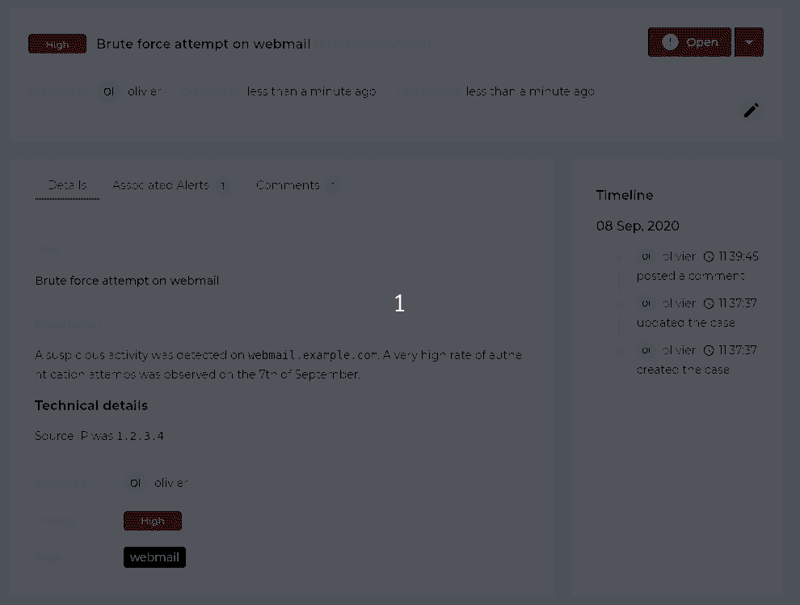
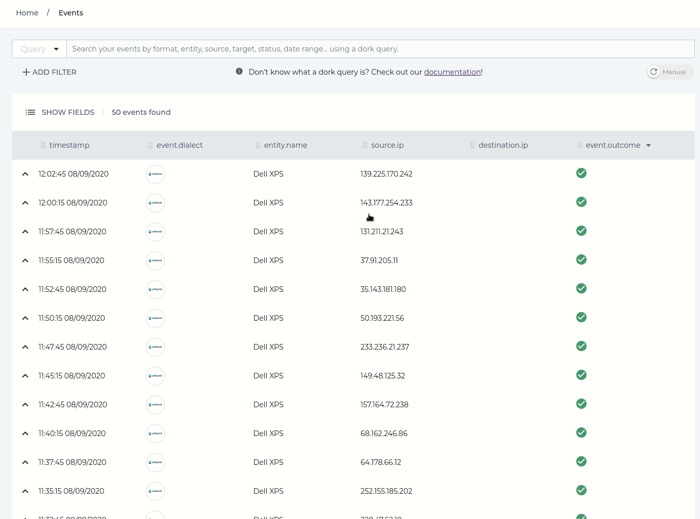
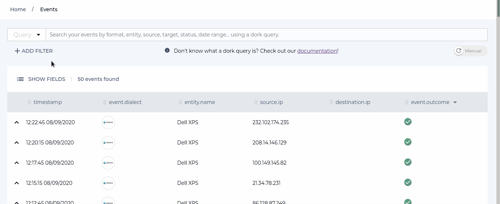
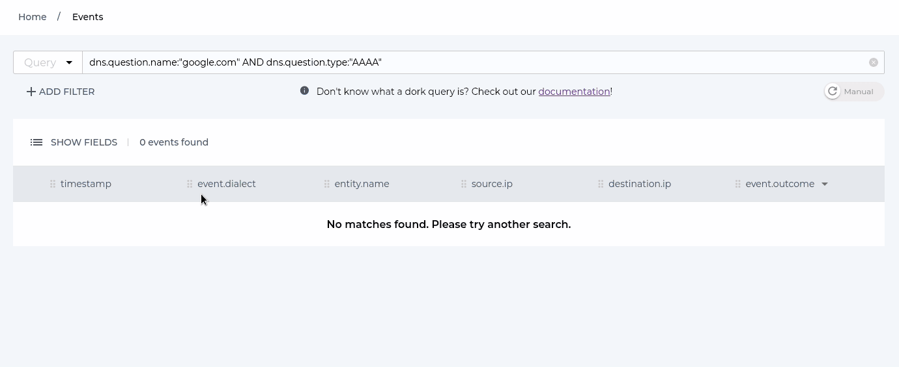
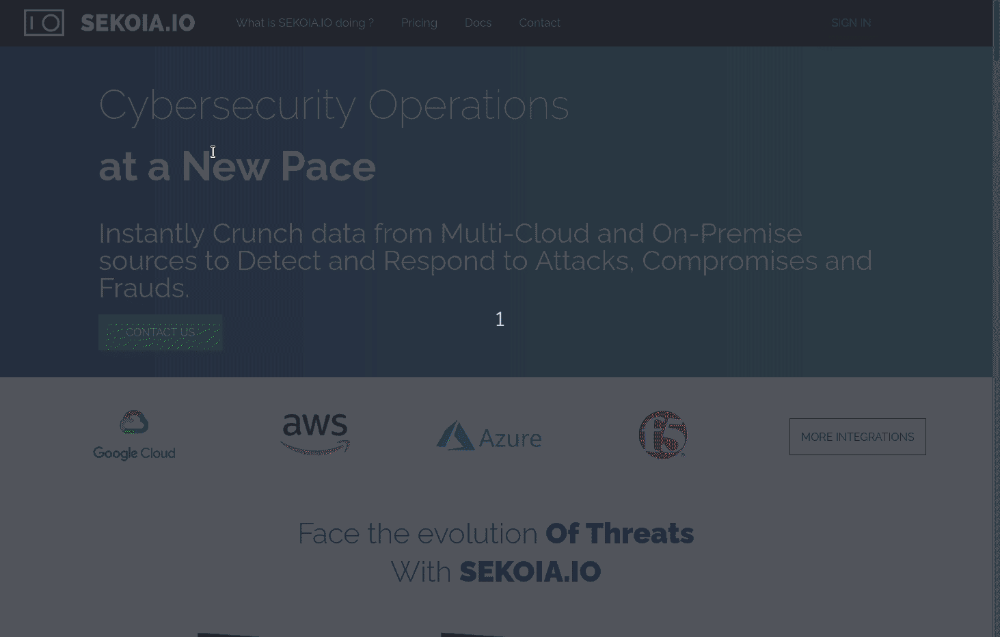

# 10/09/2020

## Case Management: New case tracking system

The Operations Center now has a new feature called “Case Management”, allowing information relating to security records to be shared. A “case” consists of a title, description, severity, and may be associated with alerts from the Operations Center.

A “case” has a lifecycle (currently, open or closed) and can be assigned to one or more people.
This feature allows, for example, a security supervision team to escalate alerts to another team for clarification or to group alerts that seem related to facilitate analysis.


“Case Management” replaces the old “incident” management mechanism. Among the many changes, we can mention the possibility of defining tags, assigning a case to one or more members of its community, adding comments or even associating alerts with a “case”. Finally, the syntax of the description of a “case” has been changed to use the Markdown language (with a graphical editor in the Operations Center).

Old “incidents” have been converted to “cases”. The switch to the use of “cases” is completely transparent, access to old “incidents” is automatically redirected to the new implementation.



## Consultation of events: redesign of the page

The page for viewing community events sent to SEKOIA.IO has been completely redesigned. It becomes more adaptable and more functional. This is the first work here, other improvements to this page will come later (search in longer periods, complex searches, etc.).

## Events table

The table displaying the list of events now provides the following possibilities:

- Adding or removing a column (except for the date of the event which is mandatory);
- Move a column by dragging and dropping the title;
- Extension of an event and thus display it in ECS, STIX or raw format;
- Adding a filter on events from a table cell.



## Search in events

Search fields in events now follow the "ECS" standard (Elastic Common Schema). Thus, to search for events with source IP address `127.0.0.1`, enter `source.ip: "127.0.0.1"` (and no longer `source: "127.0.0.1"`). This change provides access to more fields of events stored in Elasticsearch.

So to perform a search (admittedly useless) for DNS type events that requested the IPv6 address associated with `google.com`, we can use the following Dork query:

```
dns.question.name:"google.com" AND dns.question.type:"AAAA"
```

A simple search creation wizard has also been added. It allows you to create rules even without knowing the Dork syntax, used on SEKOIA.IO.



## Saving searches

The new form now offers the possibility of saving searches and finding them easily.

The backup is currently performed within the web browser, so it will not be possible to access the saved searches from another machine.



## SEKOIA.IO documentation

The code from the [SEKOIA.IO documentation](https://docs.sekoia.io/) has been moved to a public space hosted on GitHub. Now it is possible for anyone to suggest changes to the documentation very easily, by clicking on the pen icon.

Many help topics for using SEKOIA.IO have also been added to the documentation.

You can of course always send us your comments and expectations with regard to this documentation, by emailing [support](mailto:support@sekoia.io).


