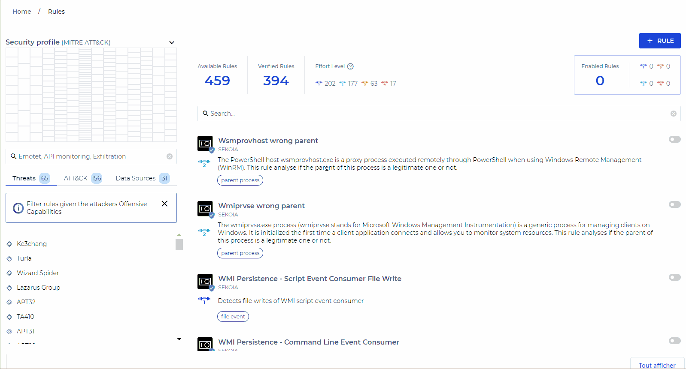
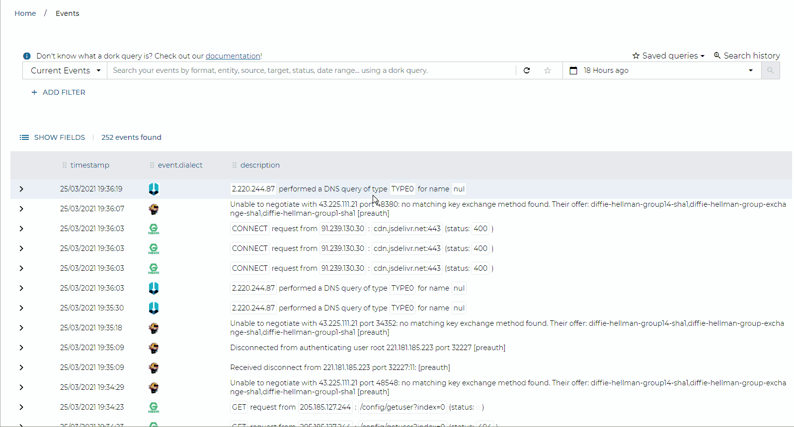

# 2021-04-01

## Detection rules: New rules catalog

On April 6, a new feature will be deployed in the Operation Center: The **“Rules Catalog”**.This functionnality will replace the **“Rules”** and **“Rules Templates”** pages.

The rules currently applied to your communities will be migrated into this new detection rule management system without any action on your part.

With this new feature, you will have access to a set of rules developped and maintained by SEKOIA that you can easily apply to your events. Many filtering possibilities will be available to select the rules and you will be able to have an overview of the MITRE ATT&CK techniques for which rules are activated. 

You will find more information about this new feature in our documentation available [here](../operation_center/rules_catalog.md).

## Consultation of events: Improvements of the page

The hunting capabilities in the events sent to SEKOIA.IO continue to be improved. You can now save your most common searches and navigate in the history of your searches. A new field called “smart description”, currently being implemented for the different event formats, allows “human” reading of events and rapid filtering on certain information.

A feature for exporting search results in csv or json formats has also been added.

## New Blogpost: Hunting and detecting Cobalt Strike

Our new blog post is out ! Discover how to ensure a proactive and defensive posture against Cobalt Strike, one of the most powerful pentesting tools hijacked by attackers in their numerous campaigns.

