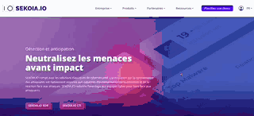

# 2021-07-05
## SEKOIA.IO's new visual identity!

SEKOIA.IO's new visual identity! 🎨
New colors on the homepage of app.sekoia.io and on the new website sekoia.io, a gradient on three major colors that represents the fusion of the three essential components of our core expertise: Cyber Threat Intelligence, Threat Detection and Remediation.

Have a look at sekoia.io to discover our vision, our products and our partner program!

## 30 new detection rules added to the catalog! 

Since the previous month, 30 new rules verified by our analysts have been added to the SEKOIA.IO XDR rules catalog. 

To protect you against the TOP 10 most exploded vulnerabilities of the last two years, we strongly recommend you to activate the following rules:

- CVE-2018-13379 (Fortinet FortiOS)
- CVE-2019-2725 (Oracle WebLogic Server)
- CVE-2019-11510 (Pulse Secure Pulse Connect Secure (PCS))
- CVE-2020-0688 (Microsoft Exchange Server)
- CVE 2018-11776 (Apache Struts 2)
- These vulnerabilities are exploited ahead of ransomware attacks but also cyber spying attacks to gain initial access into their victims' information systems.

## Cyber Threat intelligence
### New intelligence source: Hatching Triage 🔎

Our CTI database includes a new source of technical intelligence with the integration of the European sandbox Hatching Triage.

This new source will reinforce our coverage of the most active malware of the moment such as Cobalt Strike, Agent tesla, LokiBot or IcedID.

It provides our CTI database with IPs / domain names of Command & Control (C2) and hashes of about twenty malware.
A blogpost will very soon give details of this new integration with our partner Hatching Triage, stay tuned!

### Tracking of Chinese APT groups 

In June, we strengthened our monitoring of C2 malware infrastructures like ShadowPad used by several threat actors attributed to China like APT41 or Winnti Group.

## What's new in the User Center ?
### The invitations ✉️

The change of the invitation process makes it easier to : 

- Assigning multiple roles to users: Different roles can be assigned at the same time when sending the invitation.
- Adding a user known to SEKOIA.IO: You can add existing users in other communities directly to a new one without going through the email invitation and authentication process.

### Your community on SEKOIA.IO

The new "Your community" page now allows you to see with a single click:

- The date of the first log-in for all community members.
- The activation of the double authentication factor for all community members.

