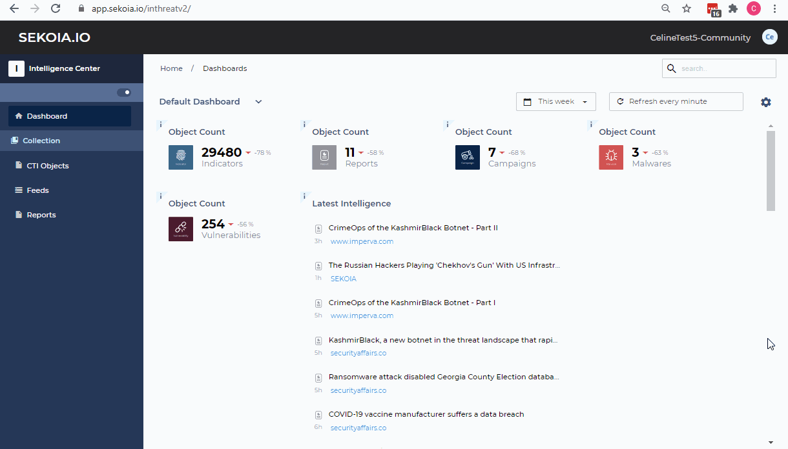

# Creation of a new API KEY

Before starting, click on 'Settings' on the top right corner in order to access the User Center.

You can create API keys that will be useful for example to automate the extraction of data from the intelligence center.

For this use, the role 'Intelligence Center Read-Only' should be given to the API key created.

