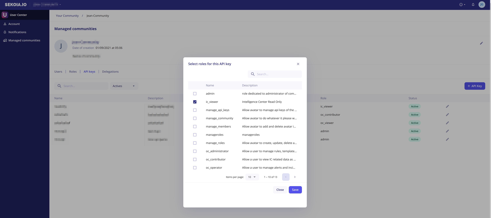

# Creation of a new API KEY

To create a new API key, click on your initials on the top right corner and then "Managed Communities" in order to access the User Center.

In the "API Keys" tab, you can visualize all the API that have been created in your community.
To create a new key :

1. Click on `+ API Key`
2. Give a name and a description to your key
3. Select one or more roles associated to your key. For instance, if you want to use your key to retrieve information from the Intelligence Center, you can use the role `ic_viewer - Intelligence Center Read-Only`
4. Click on `Save`

After that, your key will be displayed on the screen.
> **Important note** : The key will only be displayed once. Save it into a vault.

