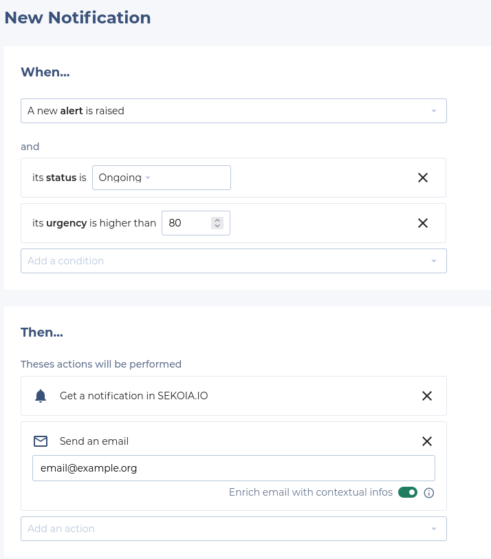
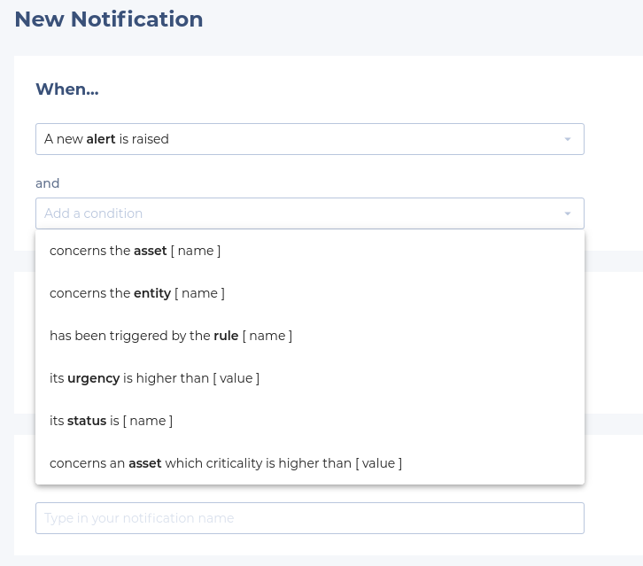
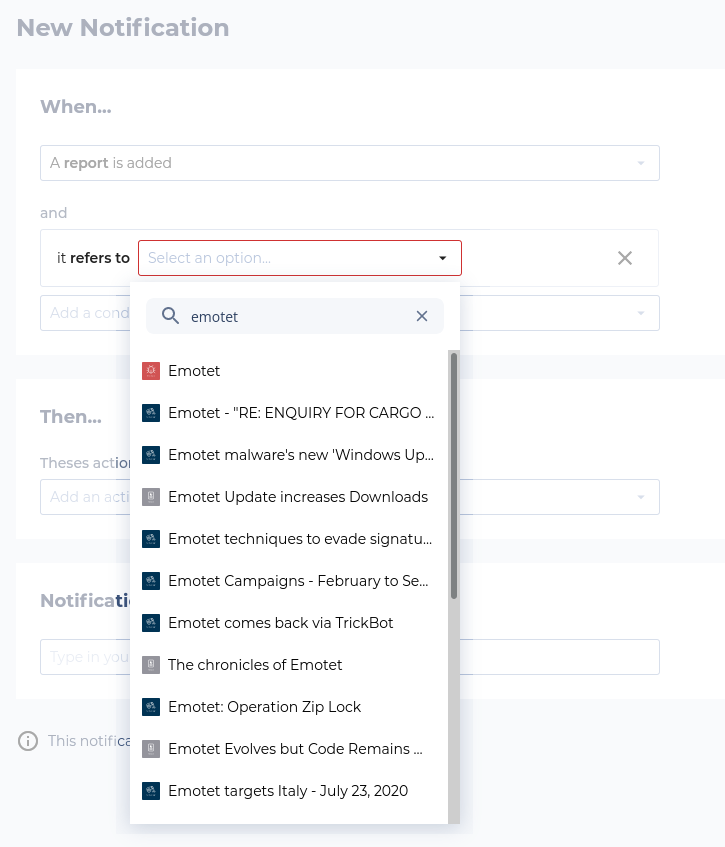

# User Center: Notification Rules

SEKOIA.IO’s User Center let you configure “Notification Rules” so you can be kept informed of new activities that happens on SEKOIA.IO. Notifications Rules will let you focus on specific SEKOIA.IO events (Operations Center alerts and Intelligence Center reports), add precise conditions and configure actions to be triggered (send an e-mail, display a notification in SEKOIA.IO, etc.).

This documentation will let you go deeper into SEKOIA.IO’s notification mechanism.

## Available Conditions

To write a new notification rule, the first step consists in selecting an “event” and conditions that will trigger your notification rule.

### Operations Center Alerts

You can configure your notification rule to be triggered on “**alerts**” (that can be either new or already existing). Then, you’ll have to choose one or multiple conditions amongst multiple options (alert status, its urgency, asset concerned by the alert, etc.).

For example, you can decide to trigger a notification when the following criteria are met:

- Status of the new alert is “Ongoing”.
- Urgency of the new alert is higher than 80.
- Involved asset is “My Critical Asset”.

### Intelligence Center Reports

You can configure your notification rule to be triggered when a new “report” is merged in SEKOIA.IO’s Intelligence Center. Then, you’ll have to choose one or multiple conditions amongst multiple options (its name contains or description some text, it concerns some country, etc.).

If you want to only trigger a notification when a report that concerns a specific CTI object is added to the Intelligence Center, you can choose the “it refers to” option. Then you’ll be able to select a CTI object from the available list:

## Triggered Actions

When your conditions are configured, you want to decide which action should be triggered by the notification mechanism. You can enable one or more action for each notification rule.

For example you can decide to send an e-mail and to send a message on a Mattermost channel.

### SEKOIA.IO Notification

The “Notification” action allows you to send an “in-app” notification that will be made available across SEKOIA.IO. All notifications can be accessed from the “bell” icon on the top right. By clicking there, the notification panel with all notifications will be displayed.

### E-Mail Notification

The “E-mail notification” will let you send an e-mail to an arbitrary address with the notification content and a link to SEKOIA.IO. You can also configure your rule to add more contextual information related to your alert (send information about the rule that raised an alert, impacted asset, etc.).

### Mattermost Notification

The “Mattermost notification” will let you send messages to any Mattermost instance (Mattermost is a popular chat service). To do so, you’ll have to configure a new “Incoming Webhook” on your Mattermost instance and choose to which Mattermost channel the message should be sent to.

You can refer to the Mattermost documentation on how to [create a new Mattermost “incoming webhook”](https://docs.mattermost.com/developer/webhooks-incoming.html).
