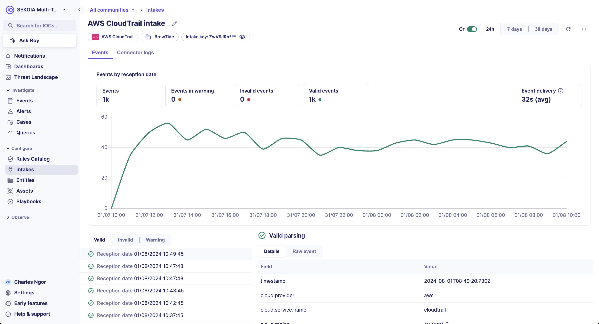
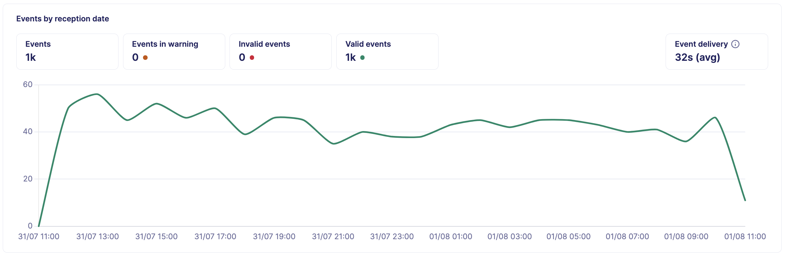
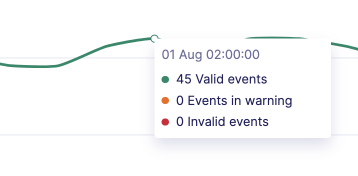
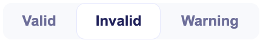
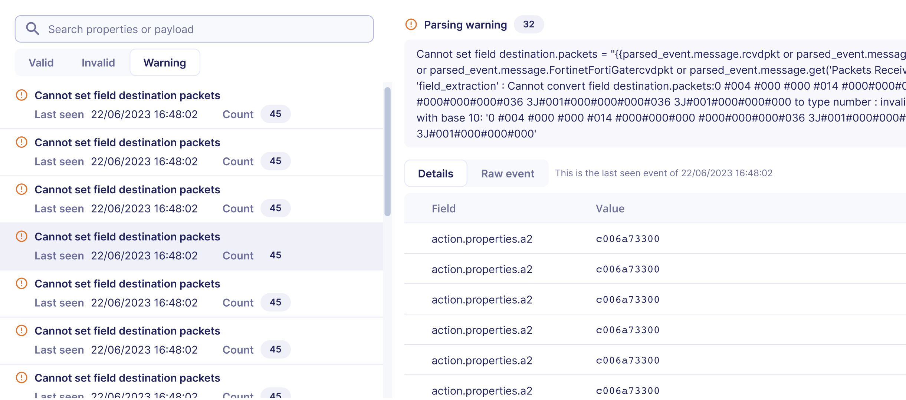
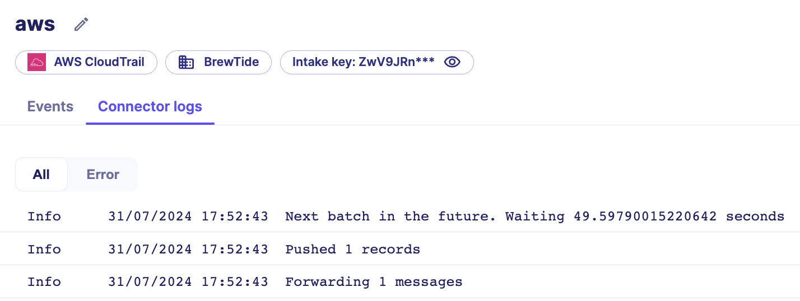
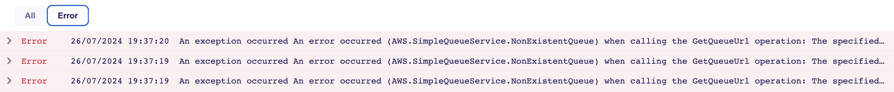
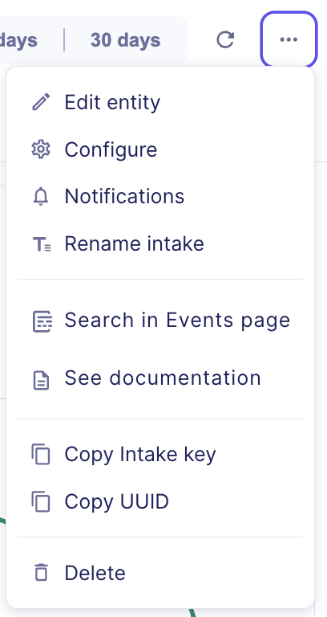

# Intake details page

The intake details page is the central health dashboard for a single data source. It surfaces ingestion metrics, parsing outcomes, event delivery lag, and connector status in one view.

## Page overview

The details page is organized into three main sections:

| Section | Description |
| --- | --- |
| Events graph | Visual overview of ingestion volume, event validity, and delivery lag for the selected period |
| List of recent events | Latest events received, with parsing details and error filtering |
| Connector log | Latest connector execution logs (Pull intakes only) |

## Events graph

The events graph displays ingestion metrics for the selected period: 24 hours, 7 days, or 30 days.

!!! warning "Events are plotted by reception date"
    Events are displayed using their reception date, not the source timestamp. This ensures recently received events always appear in the graph, even when source timestamps are incorrect or significantly delayed.

### Graph metrics

| Metric | Description |
| --- | --- |
| **Events** | Total number of events ingested in the selected period |
| **Events in warning** | Number of events that triggered a warning during parsing |
| **Invalid events** | Number of events that failed parsing |
| **Valid events** | Number of successfully parsed events |
| **Event delivery** | Average time between the original event creation date at the source and its reception date at Sekoia |

!!! tip "View per-unit event counts"
    Hover over the graph to view the number of events for each time unit.

## Event delivery

The event delivery metric is a lag indicator. It computes the average time elapsed between when a source system generates an event and when Sekoia receives and indexes it.

!!! warning "A high value does not always indicate a Sekoia issue"
    This metric covers the full end-to-end path from the source to Sekoia. A high value can reflect delays introduced outside of Sekoia's infrastructure, such as buffering on your network, on an intermediary relay (for example, an Event Hub), or at the endpoint level. If the **Connector log** tab shows no errors, the delay is most likely introduced upstream.

!!! tip "The average can be misleading in burst scenarios"
    Because this is an average, a small number of heavily delayed events can significantly inflate the displayed value, even if most events arrive in near real-time. For example, if an endpoint was offline for several hours and reconnects while flushing all its buffered events at once, the average delivery time will appear high even though Sekoia's collection pipeline is operating normally.

### Abnormal value causes

| Potential issue | Description |
| --- | --- |
| Event wrongly dated | Events with incorrect source timestamps cause a high or negative delivery value |
| Data source timezone | An incorrect timezone configuration causes a high or negative delivery value |
| Data source unavailable | If the source is offline for an extended period, buffered events create a spike in lag when they are eventually sent |
| Network or bandwidth issues | Network congestion increases delivery time |
| Events burst | An unusually high volume of events can overload ingestion and increase lag |
| Upstream buffering | For pull intakes that route events through a partner relay (such as an Event Hub), events may accumulate upstream before reaching Sekoia. This typically occurs when an endpoint reconnects after being offline and sends all its buffered events at once |

### Diagnose a high event delivery value

To identify the cause of a high event delivery value:

1. Check the **Connector log** tab (available for Pull intakes only). If the connector shows no errors, the latency is most likely introduced upstream and not by Sekoia.
2. Review the timestamps in the **List of recent events**. If events have old creation dates but were received just now, the source or an intermediary is buffering events.
3. If you cannot determine the cause, contact Sekoia support. Internal pipeline metrics are monitored separately and are not exposed in the UI.

## List of recent events

The recent events list displays the latest events received for the intake. Events are ordered by reception date.

| Element | Description |
| --- | --- |
| **Show more** button | Loads additional events beyond the default view |
| Event type filter | Filters the list to show only invalid or warning events |
| Event detail panel | Shows the raw log and parsing result for a selected event |

### Invalid and warning messages

Use the filter above the event list to display only invalid or warning messages. For each parsing issue, the list shows:

| Field | Description |
| --- | --- |
| Message | The parsing error message |
| Last seen | The last date the issue occurred |
| Occurrences | The total number of times the issue was detected |

Select an entry to inspect the last occurrence of the event and troubleshoot the issue.

!!! note "Storage optimization"
    To manage storage costs, Sekoia only stores the last occurrence of each invalid event.

## Connector log

The **Connector log** tab is only available for Pull intakes. It shows the latest execution logs of the connector.

| Log level | Purpose |
| --- | --- |
| **Info** | Confirms the connector is running as expected |
| **Error** | Indicates a failure that requires investigation |

Use the filter to display **Error** logs only.

## Intake menu reference

The intake menu is accessible from the intake details page. It exposes all management actions for the intake.

| Action | Available for | Description |
| --- | --- | --- |
| **Edit entity** | All intakes | Change the entity associated with the intake |
| **Configure** | Pull intakes only | Update connector parameters such as credentials or configuration values |
| **Notifications** | All intakes | Set up inactivity alerts for the intake |
| **Rename** | All intakes | Change the intake display name |
| **Search events** | All intakes | Open the intake's events in the Events page |
| **Documentation** | All intakes | Open the integration documentation for this intake format |
| **Copy intake key** | All intakes | Copy the intake key to the clipboard |
| **Copy intake UUID** | All intakes | Copy the intake UUID to the clipboard |
| **Delete** | All intakes | Permanently delete the intake |

## Related articles

- [Intakes](/xdr/features/collect/intakes.md): Concept overview of what intakes are, how they connect to Sekoia, and what the different event types mean.

- [Manage intakes](/xdr/features/collect/manage_intakes.md): Step-by-step procedures for creating, configuring, renaming, and deleting intakes.

- [Turn on notifications](/getting_started/notifications-Listing_Creation.md): How to configure notification channels and triggers for intake inactivity alerts.

- [Integrations](/integration/index.md): Full catalog of supported data source integrations and their setup documentation.
