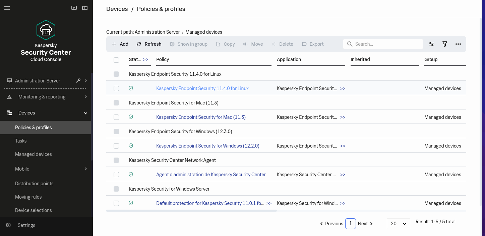

uuid: 255764ef-eaf6-4964-958e-81b9418e6584
name: Kaspersky Endpoint Security
type: intake

## Overview

**Kaspersky Endpoint Security** is an advanced security solution designed to safeguard businesses, their networks, and data against a wide array of cyber threats. Employing a multi-layered approach, it integrates various protection technologies including signature-based detection, heuristic analysis, machine learning, and real-time monitoring to detect and thwart malware, ransomware, zero-day attacks, and other threats effectively.

{!_shared_content/operations_center/detection/generated/suggested_rules_255764ef-eaf6-4964-958e-81b9418e6584_do_not_edit_manually.md!}

{!_shared_content/operations_center/integrations/generated/255764ef-eaf6-4964-958e-81b9418e6584.md!}

## Configure

This setup guide describe how to forward events produced by **Kaspersky Endpoint Security** to Sekoia.io.

### Forward logs to Sekoia.io

1. Log in the Kaspersky Security Center Cloud Center

2. In the console, on the left panel, click on the spanner at the right of **Adminitration server**

<div style="text-align: center;">
    
</div>

3. In the **General** tab, click on **SIEM** on the menu

<div style="text-align: center;">
    
</div>

4. Click on **settings** to configure the forwarding (point 1)

<div style="text-align: center;">
    
</div>

5. Configure the forwarding
    a. Type the address of your log concentrator in the **SIEM system server address**
    b. Type the port in **SIEM system port**
    c. Select **TLS over TCP** as protocol (it’s the onyl option)
    d. Select the way to authenticate the concentrator’s certificate
    e. Click on OK

    !!! warning

    If you need to generate a custom certificate:

    ```bash
    $ openssl req -new -x509 -keyout server.key -out server.crt -nodes
    $ cat server.key server.crt > server.pem
    $ openssl x509 -in cert.crt -noout -fingerprint # copy the output
    ```

    <div style="text-align: center;">
        
    </div>
        
6. Check **Automatically export event to SIEM system database** (point 2)

<div style="text-align: center;">
    
</div>

### Forward logs to Sekoia.io

1. In the console, on the left menu, click on **Devices** > **Policies & profiles**

<div style="text-align: center;">
    
</div>

2. For each policy **Kapersky Endpoint Security for X**, click on the policy

<div style="text-align: center;">
    
</div>

3. In the policy, select the **Event configuration** tab

<div style="text-align: center;">
    
</div>

4. On the left panel, select the section **Critical**. Select all event types and click on **Mark for export to SIEM system by using Syslog**

<div style="text-align: center;">
    
</div>

5. Select the section **Warning** and select all event types and click on **Mark for export to SIEM system by using Syslog**.

### Create the intake

Go to the [intake page](https://app.sekoia.io/operations/intakes) and create a new intake from the format **Kaspersky Endpoint Security**.
