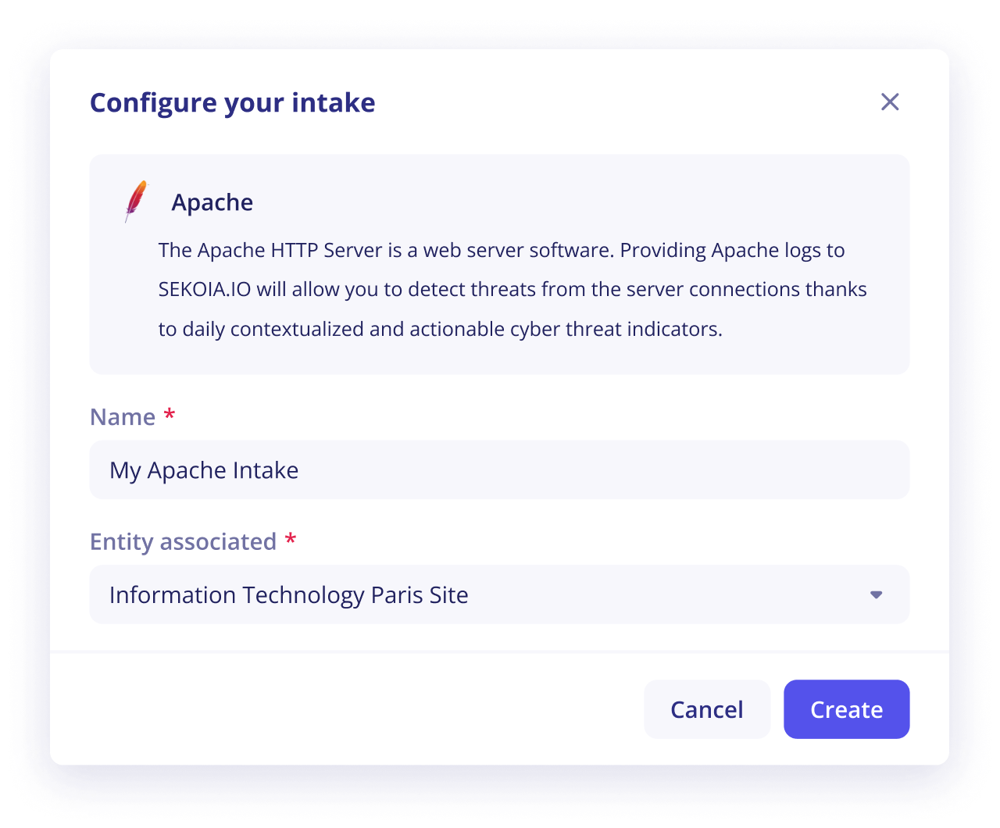
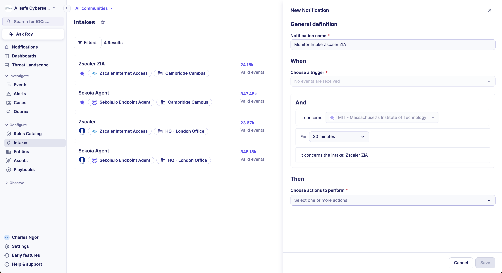
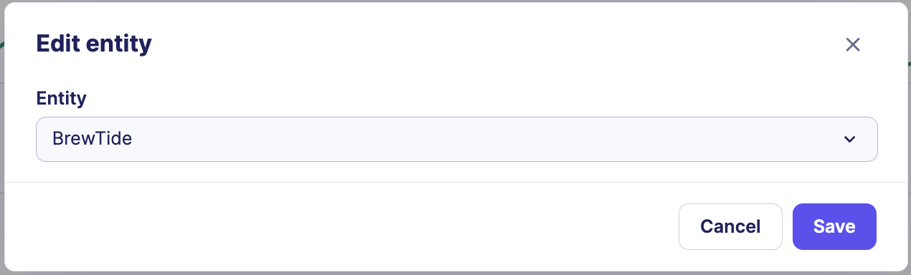
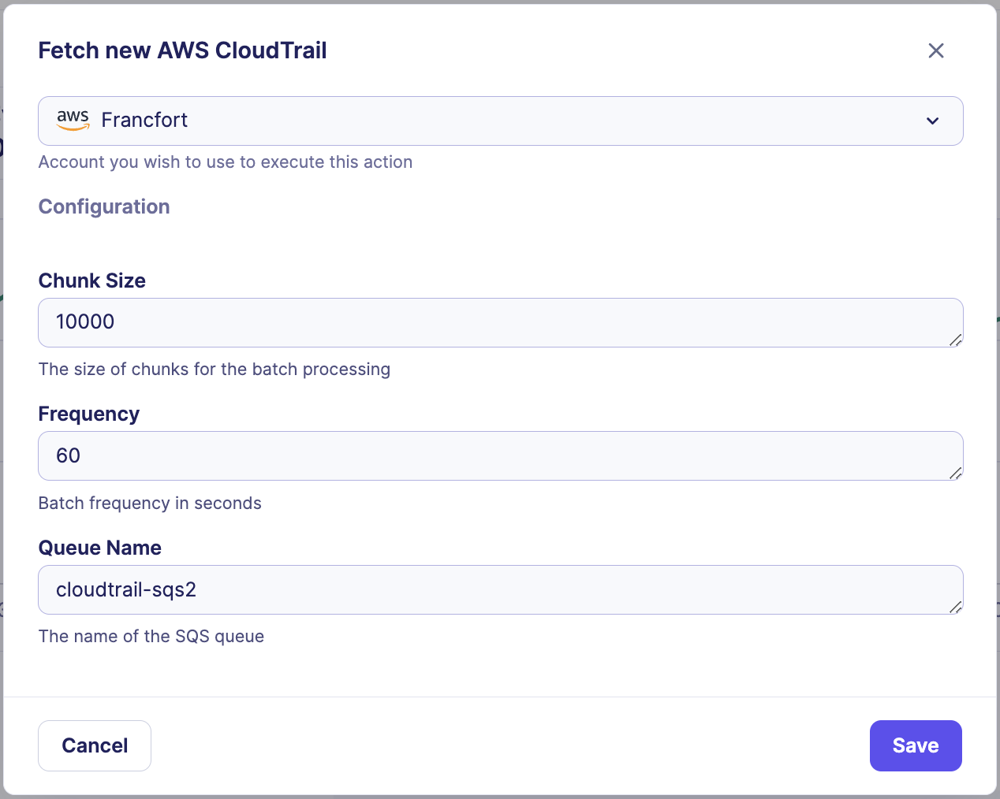
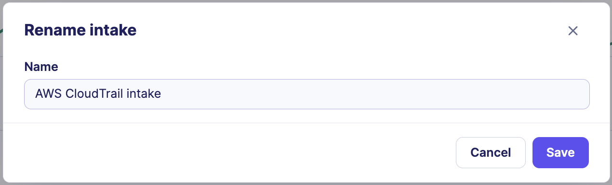

# Manage intakes

This article covers all procedures for creating and managing intakes in Sekoia, from initial setup to renaming, reconfiguring, and deleting.

## Prerequisites

- You must have the appropriate role in your Sekoia community to create or modify intakes.
- For Pull intakes, you must have valid credentials for the data source you want to connect.

## Create an intake

To add a new data source to Sekoia:

1. Navigate to **Intakes** in the Operations Center.
2. Click **New intake**.
3. In the catalog, search for the format that matches your data source and select it.
4. Enter a name for the intake and select the entity it belongs to.
5. If the intake is a Pull intake, fill in the connector configuration fields (credentials and parameters).
6. Click **Save**.

!!! note "Custom intake formats"
    If your log format is not available in the catalog, you can build a custom intake format. Refer to [Create a format](/integration/develop_integration/formats/create_a_format.md) for instructions.

## Configure a notification for an inactive intake

An inactive intake can create blind spots in your security monitoring. Configure an inactivity notification to get alerted when an intake stops sending events.

To configure an inactivity notification from the intakes listing:

1. Navigate to **Intakes** in the Operations Center.
2. On the intake card, click the menu icon, then click **Notifications**.
3. Set the inactivity duration after which the notification triggers. You can choose between 15 minutes and 24 hours.
4. Select your preferred notification channel.
5. Click **Save**.

!!! note "Alternative setup paths"
    You can also configure this notification from the **Intake details** page via the intake menu, or from **User Center > Notifications** by selecting the **No events are received** trigger.

## Edit an intake entity

To move an intake to a different entity:

1. Navigate to **Intakes** and open the intake details page.
2. In the intake menu, click **Edit entity**.
3. Select the new entity from the list.
4. Click **Save**.

## Configure a pull intake

Use this procedure to update a pull intake's connector parameters, such as authentication credentials or configuration values.

!!! note "Pull intakes only"
    The **Configure** option is only available for Pull intakes. It is not visible for push intakes.

To update the connector configuration:

1. Navigate to **Intakes** and open the intake details page.
2. In the intake menu, click **Configure**.
3. Update the configuration fields as needed.
4. Click **Save**.

!!! note "Changes apply immediately"
    Configuration changes take effect instantly. You do not need to restart the connector.

## Rename an intake

To change the display name of an intake:

1. Navigate to **Intakes** and open the intake details page.
2. In the intake menu, click **Rename**.
3. Enter the new name.
4. Click **Save**.

## Delete an intake

!!! warning "The intake key becomes unusable after deletion"
    Deleting an intake does not remove previously ingested events. However, the associated intake key is permanently invalidated. To restore the same data source connection, you must create a new intake and deploy the new intake key in your infrastructure.

To delete an intake:

1. Navigate to **Intakes** and open the intake details page.
2. In the intake menu, click **Delete**.
3. Confirm the deletion.

## Contact support

Reach out to Sekoia support in the following situations:

- The configuration recommendations in this article do not apply to your system and you need guidance on forwarding your events.
- Your log format is not available in the intake catalog. New formats are added regularly, and support can notify you when yours becomes available.

## Related articles

- [Intakes](/xdr/features/collect/intakes.md): Concept overview of what intakes are, how they connect to Sekoia, and what the different event types mean.

- [Intake details page](/xdr/features/collect/intakes_details.md): Reference for all metrics, indicators, and menu options available on the intake details page, including a full explanation of the event delivery metric.

- [Turn on notifications](/getting_started/notifications-Listing_Creation.md): How to configure notification channels and triggers for intake inactivity alerts.

- [Create a format](/integration/develop_integration/formats/create_a_format.md): How to build a custom intake format for unsupported log sources.
